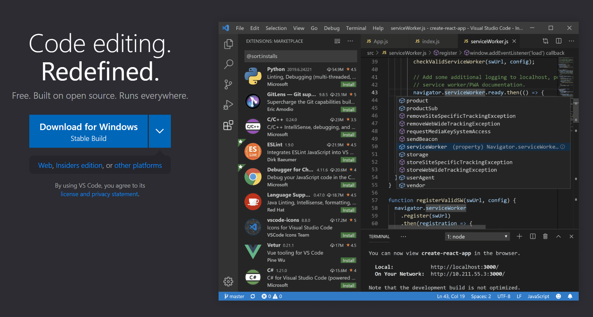
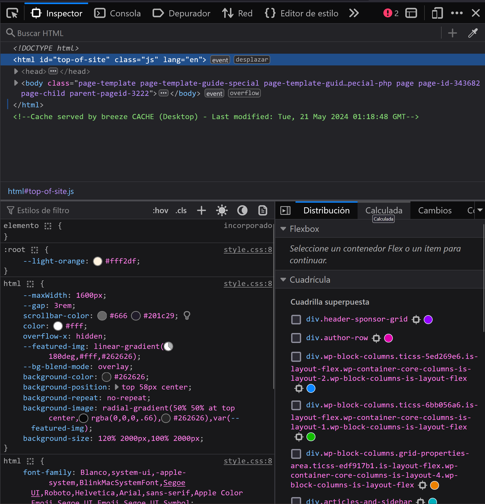
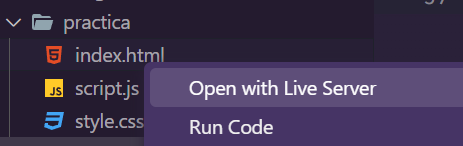
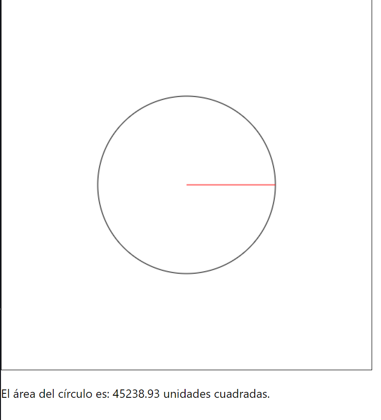

# Capítulo 1: Introducción a JavaScript Creativo

## Introducción a la programación creativa

### ¿Qué es la programación creativa?

La programación creativa es una disciplina que combina la programación informática con la creatividad artística. Su objetivo es utilizar el código como una herramienta para crear obras de arte digitales, animaciones interactivas, juegos y experiencias multimedia. La programación creativa se basa en la premisa de que la programación no es solo una herramienta para resolver problemas, sino también una forma de expresión artística.

La programación creativa se ha convertido en una disciplina muy popular en los últimos años, gracias a la creciente accesibilidad de las herramientas y tecnologías necesarias para desarrollar proyectos creativos. Con la programación creativa, puedes dar vida a tus ideas y crear proyectos interactivos que cautiven a tu audiencia.

En nuestro caso, tomaremos la programación creativa para visualizar y hacer tangible el aprendizaje de la programación. A través de ejemplos prácticos y proyectos creativos, aprenderás a programar con JavaScript de una manera divertida y estimulante.

### ¿Por qué aprender programación creativa?

La programación creativa tiene muchos beneficios, tanto para los programadores experimentados como para los principiantes. Algunas de las razones por las que deberías aprender programación creativa son:

- **Desarrollo de habilidades técnicas**: La programación creativa te permite desarrollar habilidades técnicas en programación, diseño y animación. Aprenderás a utilizar herramientas y tecnologías modernas para crear proyectos creativos.
- **Expresión artística**: La programación creativa te brinda una forma de expresión artística única. Puedes utilizar el código como un medio para crear obras de arte digitales, animaciones interactivas y experiencias multimedia.
- **Creatividad y pensamiento crítico**: La programación creativa fomenta la creatividad y el pensamiento crítico. Te desafía a pensar de forma creativa para resolver problemas y crear proyectos innovadores.
- **Oportunidades laborales**: La programación creativa es una habilidad muy demandada en la industria del diseño y la tecnología. Aprender programación creativa puede abrirte nuevas oportunidades laborales y profesionales o hacer tu perfil más atractivo para los empleadores.

## Configuración del entorno de desarrollo

Para comenzar a programar con JavaScript, necesitarás configurar un entorno de desarrollo en tu computadora. A continuación, te explicaremos cómo configurar un entorno de desarrollo básico para programar con JavaScript.

### Editor de código

El primer paso para configurar tu entorno de desarrollo es elegir un editor de código. Un editor de código es una herramienta que te permite escribir y editar código fuente. Voy a recomendar el uso de Visual Studio Code, un editor de código gratuito y de código abierto desarrollado por Microsoft. Visual Studio Code es uno de los editores de código más populares y ampliamente utilizados en la comunidad de programadores.

Puedes descargar Visual Studio Code desde su [sitio web oficial](https://code.visualstudio.com/). Una vez que hayas descargado e instalado Visual Studio Code, estarás listo para comenzar a programar con JavaScript.



### Extensiones de Visual Studio Code (opcional)

Visual Studio Code cuenta con una amplia variedad de extensiones que te permiten personalizar y ampliar sus funcionalidades. A continuación, te recomendaré algunas extensiones útiles para programar con JavaScript:

- **Prettier**: Prettier es una extensión que te ayuda a formatear tu código de forma automática y consistente. Puedes instalar Prettier desde la tienda de extensiones de Visual Studio Code. Una vez instalada, Prettier formateará tu código cada vez que guardes un archivo.

- **Auto Close Tag**: Auto Close Tag es una extensión que te permite cerrar automáticamente las etiquetas HTML al escribir el código. Esta extensión es muy útil para escribir código HTML de forma más rápida y eficiente.

- **Live Server**: Live Server es una extensión que te permite visualizar tu página web en tiempo real mientras escribes el código. Con Live Server, puedes ver los cambios que haces en tu página web de forma inmediata, sin necesidad de recargar el navegador.

- **Auto Rename Tag**: Auto Rename Tag es una extensión que te permite renombrar automáticamente las etiquetas HTML al cambiar el nombre de una etiqueta de apertura. Esta extensión es muy útil para mantener la coherencia en tu código HTML.

- **Material Icon Theme**: Material Icon Theme es una extensión que te permite personalizar los iconos de los archivos y carpetas en Visual Studio Code. Esta extensión es útil para identificar rápidamente los tipos de archivos en tu proyecto.

### Navegador web

Además de un editor de código, necesitarás un navegador web para visualizar y probar tus proyectos web. Aunque puedes utilizar cualquier navegador web para este propósito, te recomiendo utilizar **Google Chrome** o **Mozilla Firefox**, ya que son dos de los navegadores más compatibles con las tecnologías web modernas.

Puedes descargar Google Chrome desde su [sitio web oficial](https://www.google.com/chrome/) y Mozilla Firefox desde su [sitio web oficial](https://www.mozilla.org/es-ES/firefox/). Una vez que hayas instalado un navegador web en tu computadora, estarás listo para comenzar a programar con JavaScript.

### Consola del navegador

La consola del navegador es una herramienta que te permite interactuar con el código JavaScript de una página web en tiempo real. Puedes utilizar la consola del navegador para depurar tu código, probar nuevas funcionalidades y ver los resultados de tus scripts JavaScript. Para abrir la consola del navegador, sigue estos pasos:

1. Abre tu navegador web (Google Chrome o Mozilla Firefox).
2. Haz clic derecho en cualquier parte de la página web y selecciona la opción "Inspeccionar" o "Inspeccionar elemento". También puedes utilizar el atajo de teclado `Ctrl + Shift + I` en Windows o `Cmd + Option + I` en macOS.



3. Se abrirá la herramienta de desarrollo del navegador. Haz clic en la pestaña "Consola" para acceder a la consola del navegador.

### Estructura del repositorio

Para organizar tus proyectos y archivos de código, te recomiendo crear una estructura de carpetas y archivos coherente en tu repositorio. A continuación, te muestro una estructura de carpetas y archivos básica para un proyecto web:

```plaintext
mi-proyecto/
│
├── index.html
├── styles.css
└── script.js
```

En esta estructura de carpetas y archivos:

- `index.html` es el archivo principal de tu proyecto, donde se encuentra el código HTML de tu página web.
- `styles.css` es el archivo de estilos de tu proyecto, donde se encuentra el código CSS que define la apariencia de tu página web.
- `script.js` es el archivo de scripts de tu proyecto, donde se encuentra el código JavaScript que añade interactividad y funcionalidad a tu página web.

Puedes añadir más archivos y carpetas según las necesidades de tu proyecto.

Con esta estructura de carpetas y archivos, podrás organizar y gestionar tus proyectos de forma eficiente. Te recomiendo crear una carpeta para cada proyecto y mantener los archivos relacionados con ese proyecto dentro de esa carpeta.

## ¡Empieza a explorar y crear desde el primer día!

Ahora que has configurado tu entorno de desarrollo, es hora de empezar a explorar y crear con JavaScript. En la carpeta de este capítulo encontrarás un ejemplo práctico en la carpeta `practica` para que puedas empezar a experimentar con JavaScript desde el primer día.

Para ejecutar el ejemplo práctico, sigue estos pasos:

1. Descarga la carpeta `practica` a tu computadora.
2. Abre la carpeta `practica` en tu editor de código (Visual Studio Code).
3. Haz clic derecho en el archivo `index.html` y selecciona la opción "Abrir con Live Server".
   

4. Se abrirá una ventana del navegador con el ejemplo práctico. Puedes interactuar con el ejemplo y ver cómo funciona el código JavaScript.

**index.html**

```html
<!DOCTYPE html>
<html lang="es">
  <head>
    <meta charset="UTF-8" />
    <meta name="viewport" content="width=device-width, initial-scale=1.0" />
    <link rel="stylesheet" href="./styles.css" />
    <title>Canvas Circle</title>
  </head>
  <body>
    <canvas id="myCanvas" width="500" height="500"></canvas>
    <p id="area"></p>
    <script src="script.js"></script>
  </body>
</html>
```

**script.js**

```javascript
document.addEventListener("DOMContentLoaded", function () {
  const canvas = document.getElementById("canvas");
  const ctx = canvas.getContext("2d");

  const centerX = canvas.width / 2;
  const centerY = canvas.height / 2;

  const radius = 120;

  // Dibujar el círculo
  ctx.beginPath();
  ctx.arc(centerX, centerY, radius, 0, 2 * Math.PI);
  ctx.strokeStyle = "#000000";
  ctx.stroke();

  // Dibujar la línea del radio
  ctx.beginPath();
  ctx.moveTo(centerX, centerY);
  ctx.lineTo(centerX + radius, centerY);
  ctx.strokeStyle = "#FF0000";
  ctx.stroke();

  // Calcular el área del círculo
  const area = Math.PI * Math.pow(radius, 2);

  // Mostrar el área en el documento
  document.getElementById(
    "area"
  ).textContent = `El área del círculo es: ${area.toFixed(
    2
  )} unidades cuadradas.`;
});
```

**style.css**

```css
* {
  box-sizing: border-box;
}

body {
  margin: 0;
  font-family: system-ui, sans-serif;
  color: black;
  background-color: white;
}

nav {
  display: flex;
  flex-wrap: wrap;
  align-items: center;
  justify-content: center;
  padding: 0.5rem;
  gap: 0.5rem;
  border-bottom: solid 1px #aaa;
  background-color: #eee;
}

nav a {
  display: inline-block;
  min-width: 9rem;
  padding: 0.5rem;
  border-radius: 0.2rem;
  border: solid 1px #aaa;
  text-align: center;
  text-decoration: none;
  color: #555;
}

nav a[aria-current="page"] {
  color: #000;
  background-color: #d4d4d4;
}

main {
  padding: 1rem;
}

h1 {
  font-weight: bold;
  font-size: 1.5rem;
}

#myCanvas {
  border: 1px solid #000;
}
```

### Descripción del ejemplo práctico

En este ejemplo práctico, hemos creado un círculo en un lienzo HTML5 utilizando JavaScript. El círculo se dibuja en el centro del lienzo con un radio de 120 píxeles. También hemos dibujado una línea que representa el radio del círculo y hemos calculado el área del círculo utilizando la fórmula `π * r²`.

Iremos desglosando el código y explicando cada parte en detalle en los capítulos siguientes. Por ahora, puedes ejecutar el ejemplo práctico y experimentar con el código para ver cómo funciona.

#### Archivo `index.html`

En el archivo `index.html`, es donde se define la estructura básica de la página web. HTML es un lenguaje de marcado que se utiliza para definir la estructura y el contenido de una página web. Este archivo HTML se define primero con la etiqueta `<!DOCTYPE html>` que indica al navegador que se trata de un documento HTML5. A continuación, se definen las etiquetas `<html>`, `<head>` y `<body>` que contienen el contenido de la página web.

En el `<head>` se definen los metadatos de la página, como el juego de caracteres, la vista previa y el título de la página. También se enlaza el archivo de estilos `style.css` que define la apariencia de la página web. En el `<body>` se define el lienzo `<canvas>` donde se dibujará el círculo y se enlaza el archivo de scripts `script.js` que contiene el código JavaScript para dibujar el círculo.

```html
<canvas id="canvas"></canvas>
```

En esta línea, se define un lienzo `<canvas>` con el identificador `canvas`. El lienzo es un elemento HTML5 que se utiliza para dibujar gráficos, animaciones y juegos en una página web. En este caso, utilizaremos el lienzo para dibujar el círculo y la línea del radio.

```html
<script src="./script.js"></script>
```

En esta línea, se enlaza el archivo de scripts `script.js` que contiene el código JavaScript para dibujar el círculo y calcular el área. El archivo de scripts se carga al final del `<body>` para asegurar que el lienzo y los elementos HTML estén disponibles antes de ejecutar el código JavaScript.

#### Archivo `script.js`

En el archivo `script.js`, es donde se define el código JavaScript que dibuja el círculo en el lienzo y calcula el área del círculo. JavaScript es un lenguaje de programación de alto nivel que se utiliza para añadir interactividad y funcionalidad a una página web. En este caso, utilizaremos JavaScript para dibujar el círculo y calcular el área del círculo.

Además, el código JavaScript realiza una manipulación del DOM para mostrar el área del círculo en el documento. El DOM (Document Object Model) es una representación en forma de árbol de la estructura de una página web que permite acceder y manipular los elementos HTML de la página.

#### Archivo `styles.css`

En el archivo `styles.css`, es donde se define el código CSS que define la apariencia de la página web. CSS es un lenguaje de estilos que se utiliza para dar formato y estilo a los elementos HTML de una página web. En este caso, utilizaremos CSS para definir los estilos del lienzo, el texto y los elementos HTML de la página web.



## Conclusión

En este capítulo, hemos introducido la programación creativa y hemos configurado un entorno de desarrollo básico para programar con JavaScript. Hemos explorado las herramientas y tecnologías necesarias para desarrollar proyectos creativos y hemos creado un ejemplo práctico para que puedas empezar a experimentar con JavaScript desde el primer día.

No te preocupes si no entendiste el 99% del código del ejemplo práctico. En los capítulos siguientes, iremos abordando distintos temas y conceptos de JavaScript de forma gradual y detallada. Verás como poco a poco irás comprendiendo y dominando el lenguaje.

## Recursos adicionales

- [Código de la clase](https://stackblitz.com/edit/stackblitz-starters-fpdg1e?file=script.js)
- [Repositorio de material y ejemplos](https://github.com/joshuacba08/Programacion-Creativa-JS)
