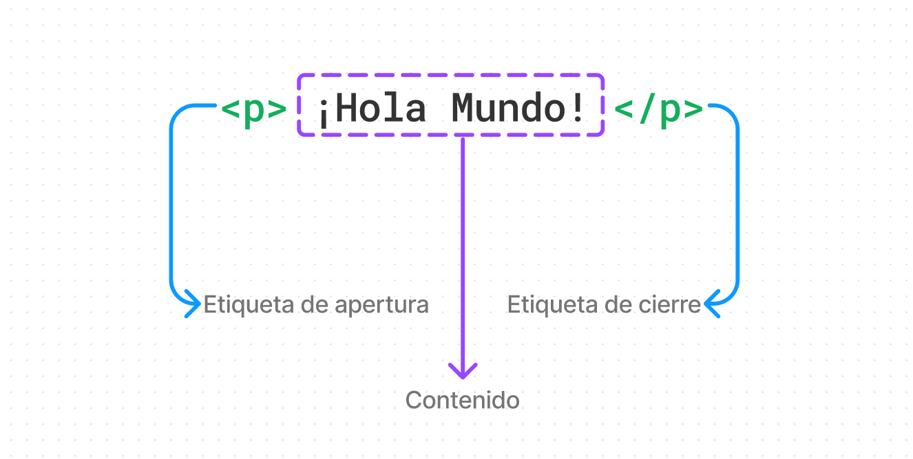

# Capítulo 4: HTML, el DOM y CSS

En este capítulo haremos un breve repaso por los conceptos básicos de HTML, el DOM y CSS. Aunque no es el objetivo de este libro profundizar en estos temas, es importante tener una idea general de cómo funcionan para poder entender mejor cómo se integran con JavaScript. De esta manera, podrás desarrollar tus propias aplicaciones web interacgtivas. 

Además abordaremos un tema elemental para construit aplicaciones web interactivas: el DOM (Document Object Model). El DOM es una representación de la estructura de un documento HTML que permite a los programadores manipular el contenido, estructura y estilo de una página web y JavaScript es el lenguaje que nos permite interactuar con el DOM.

## Introductión a HTML y el DOM

### HTML
HTML (HyperText Markup Language) es el lenguaje de marcado estándar para crear páginas web. HTML describe la estructura de una página web semánticamente y originalmente incluía atributos para definir la apariencia de la página. Sin embargo, con el tiempo, se ha vuelto común separar la estructura de una página web de su estilo y comportamiento.

Las anotasiones de HTML se llaman "etiquetas" y son elementos que rodean el contenido de una página web. Por ejemplo, la etiqueta `<p>` se utiliza para definir un párrafo y la etiqueta `<h1>` se utiliza para definir un encabezado de nivel 1. En pocas palabras, una etiqueta HTML es un nombre rodeado por corchetes angulares, como `<nombre_etiqueta>`.

#### Ejemplo de una hoja HTML básica | `index.html`
```html
<!DOCTYPE html>
<html>
<head>
    <title>HTML, el DOM y CSS</title>
</head>
<body>
    <h1>HTML, el DOM y CSS</h1>
    <p>Este es un párrafo de ejemplo.</p>
</body>
</html>
```

En este ejemplo, la etiqueta `<html>` es el elemento raíz de un documento HTML y contiene dos elementos secundarios `<head>` y `<body>`. El elemento `<head>` contiene metadatos sobre el documento y el elemento `<body>` contiene el contenido visible de la página web.



<p style="text-align: center; font-size:12px; font-family: sans-serif; position:relative; top:-24px; font-style:italic; font-weight: 100; opacity:80%">Anatomía de un elemento de HTML</p>

Todo lo que se encuentra entre las etiquetas de apertura y cierre de un elemento se conoce como contenido de ese elemento. En la mayoría de los casos, los elementos HTML se anidan dentro de otros elementos HTML. Por ejemplo, el elemento `<p>` se anida dentro del elemento `<body>` en el ejemplo anterior.

El contenido del elemento p, ubicado entre la etiqueta <p> de apertura y la etiqueta </p> de cierre, es el texto real que aparecerá en el párrafo; en este caso, ¡Hola mundo!

<div style="background-color:black; color:white; width:70px; text-align:center;padding:4px; font-size:20px; font-family: sans-serif">Nota:</div> 
Los elementos HTML también pueden tener atributos que proporcionan información adicional sobre el elemento. Los atributos se especifican en la etiqueta de apertura y generalmente constan de un nombre y un valor. Por ejemplo, el atributo `href` se utiliza en la etiqueta `<a>` para especificar la URL de destino de un enlace.

#### Ejemplo de un enlace HTML | `index.html`
```html
<!DOCTYPE html>
<html>
<head>
    <title>HTML, el DOM y CSS</title>
</head>
<body>
    <h1>HTML, el DOM y CSS</h1>
    <p>Este es un párrafo de ejemplo.</p>
    <a href="https://www.google.com">Enlace a Google</a>
</body>
</html>
```

En este ejemplo, la etiqueta `<a>` se utiliza para definir un enlace y el atributo `href` se utiliza para especificar la URL de destino del enlace. El texto entre las etiquetas de apertura y cierre de un enlace se conoce como texto de anclaje y se mostrará como un hipervínculo en la página web.


