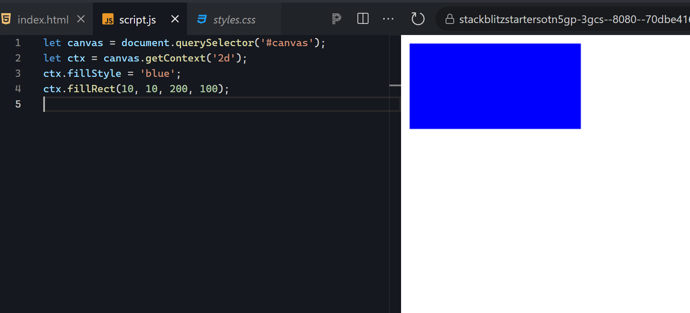
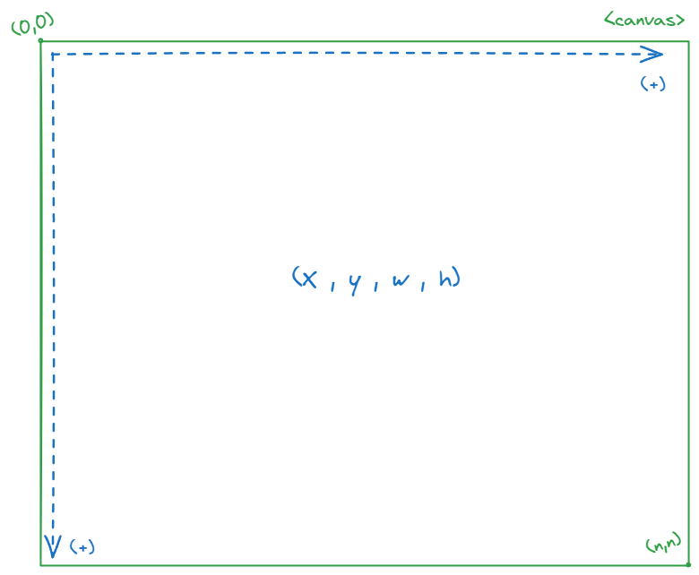
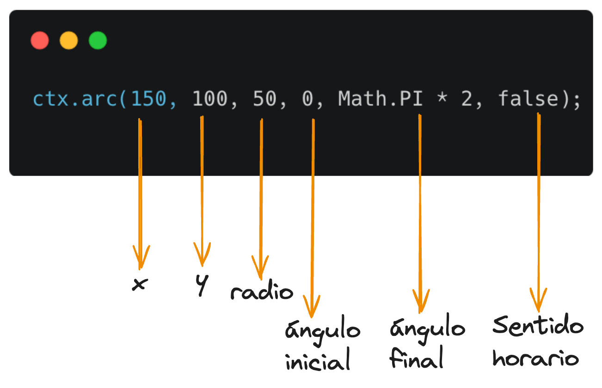

# Capítulo 5: El elemento Canvas

Uno de los elementos más interactivos de HTML es el elemento lienzo (Canvas). Este elemento actúa como el lienzo de un pintor: le proporciona espacio para dibujar imágenes dentro de la ventana del navegador utilizando JavaScript. Es más, al borrar repetidamente imágenes antiguas y dibujar otras nuevas, puedes crear animaciones en el lienzo. En este sentido, el elemento lienzo se parece más a la pantalla de una sala de cine, donde la imagen se actualiza muchas veces por segundo para crear la apariencia de movimiento.

En este capítulo, aprenderá cómo crear elementos de lienzo y cómo usar la API de Canvas, que le brinda una forma de manipular el lienzo a través de JavaScript. Escribirás JavaScript para dibujar imágenes estáticas en el lienzo. Luego, creará una aplicación de dibujo interactiva sencilla. Finalmente, aprenderá los conceptos básicos de la creación de animaciones 2D en el lienzo.

## Creación de un elemento Canvas

Para crear un elemento lienzo en una página web, simplemente agregue la etiqueta `<canvas>` a su documento HTML. La etiqueta `<canvas>` no tiene contenido, pero tiene dos atributos importantes: `width` y `height`. Estos atributos especifican el ancho y la altura del lienzo, respectivamente. Por ejemplo, el siguiente código HTML crea un lienzo con un ancho de 300 píxeles y una altura de 300 píxeles:

#### `index.html`

```html
<!DOCTYPE html>
<html>
  <head>
    <title>Canvas</title>
    <link rel="stylesheet" href="styles.css" />
  </head>
  <body>
    <canvas id="canvas" width="300" height="300"></canvas>
    <script src="script.js"></script>
  </body>
</html>
```

En este ejemplo, hemos creado un lienzo con un ancho de 300 píxeles y una altura de 300 píxeles. El lienzo se identifica con el atributo `id="canvas"`, que nos permitirá acceder al lienzo desde JavaScript. El script de JavaScript se carga desde un archivo externo llamado `script.js`, que se incluye en la página web utilizando la etiqueta `<script>`.

## Haciendo dibujos estáticos

Ahora que tenemos un elemento canvaas, estamos listos para dibujar en él. Para dibujar en un lienzo, necesitamos acceder al contexto de dibujo del lienzo. El contexto de dibujo es un objeto que proporciona métodos y propiedades para dibujar en el lienzo. Para acceder al contexto de dibujo de un lienzo, utilizamos el método `getContext()` en el elemento lienzo. El método `getContext()` toma un argumento que especifica el tipo de contexto de dibujo que queremos usar. En este capítulo, nos centraremos en el contexto de dibujo 2D, que se puede acceder utilizando el argumento `"2d"`.

#### `script.js`

```javascript
let canvas = document.querySelector("#canvas");
let ctx = canvas.getContext("2d");
ctx.fillStyle = "blue";
ctx.fillRect(10, 10, 200, 100);
```

En este ejemplo, hemos accedido al contexto de dibujo 2D del lienzo utilizando el método `getContext("2d")`. Luego, hemos establecido el color de relleno del contexto de dibujo en azul utilizando la propiedad `fillStyle`. Finalmente, hemos dibujado un rectángulo azul en el lienzo utilizando el método `fillRect()`. El método `fillRect()` toma cuatro argumentos: las coordenadas `x` e `y` del punto de inicio del rectángulo y el ancho y la altura del rectángulo.

Al cargar la página web en el navegador, veras un rectángulo azul dibujado en el lienzo. Puedes cambiar el color de relleno y las dimensiones del rectángulo modificando los valores de las propiedades y los argumentos del contexto de dibujo.



<p style="text-align: center; font-size:12px; font-family: sans-serif; position:relative; top:-24px; font-style:italic; font-weight: 100; opacity:80%">Renderizado de un rectángulo de color azul dentro del canvas</p>

<div style="background-color:black; color:white; width:70px; text-align:center;padding:4px; font-size:20px; font-family: sans-serif">Nota:</div> 
*Puedes dibujar gráficos 3D en el lienzo pasando la cadena "webgl" o "webgpu" al método getContext en lugar de "2d", pero ambos son mucho más complicados que los gráficos 2D y están fuera del alcance de este libro.*

Cualquier llamada posterior a `fillRect` usará el mismo `fillStyle`, por lo que también producirán rectángulos azules (hasta que establezcas un nuevo `fillStyle`, claro está). Puedes confirmar esto dibujando algunos rectángulos más en el lienzo.

### Eje X y Eje Y

Es importante aclarar que la coordenada `(0, 0)` en el lienzo se encuentra en la esquina superior izquierda. Las coordenadas `x` aumentan hacia la derecha y las coordenadas `y` aumentan hacia abajo. Por lo tanto, el punto `(0, 0)` es la esquina superior izquierda del lienzo, el punto `(300, 0)` es la esquina superior derecha, el punto `(0, 300)` es la esquina inferior izquierda y el punto `(300, 300)` es la esquina inferior derecha.



<hr>

##### Vamos a practicar 💻

1. Crea un nuevo archivo HTML llamado `index.html` y agrega el código HTML anterior para crear un lienzo con un ancho de 300 píxeles y una altura de 300 píxeles.
2. Crea un nuevo archivo JavaScript llamado `script.js` y agrega el código JavaScript anterior para dibujar un rectángulo azul en el lienzo.
3. Abre el archivo `index.html` en tu navegador y observa el rectángulo azul dibujado en el lienzo.
4. Modifica el color de relleno y las dimensiones del rectángulo para experimentar con el dibujo en el lienzo.
5. Dibuja más rectángulos en el lienzo para practicar el uso del contexto de dibujo.
6. Experimenta con las coordenadas `x` e `y` para comprender cómo se relacionan con la posición de los elementos en el lienzo.

<hr>

### Dibujando rectángulos delineados

Hasta ahora, hemos dibujado rectángulos rellenos en el lienzo. Sin embargo, también podemos dibujar rectángulos delineados en el lienzo utilizando el método `strokeRect()`. El método `strokeRect()` funciona de manera similar al método `fillRect()`, pero en lugar de rellenar el rectángulo con un color sólido, solo dibuja el contorno del rectángulo. Por ejemplo, el siguiente código JavaScript dibuja un rectángulo delineado en el lienzo:

#### `script.js`

```javascript
let canvas = document.querySelector("#canvas");
let ctx = canvas.getContext("2d");
ctx.lineWidth = 2;
ctx.strokeStyle = "red";
ctx.strokeRect(10, 10, 200, 100);
```

Primero, especificamos el ancho de la línea del contexto de dibujo en 2 píxeles utilizando la propiedad `lineWidth`. Luego, establecemos el color de la línea del contexto de dibujo en rojo utilizando la propiedad `strokeStyle`. Finalmente, dibujamos un rectángulo delineado en el lienzo utilizando el método `strokeRect()`. Al cargar la página web en el navegador, verás un rectángulo delineado en rojo en el lienzo.


Cuando se establecen estilos en el contexto de dibujo, como el ancho o el color de la línea, esas configuraciones se aplican solo a las adiciones posteriores al lienzo. Es decir, no afectan retroactivamente nada que ya se haya dibujado. En este sentido, el lienzo es realmente muy parecido a un lienzo físico, donde el estilo actual está determinado por el color de la pintura y el tipo de pincel que se está utilizando en ese momento. Para demostrarlo, dibujaremos varios rectángulos con diferentes colores.

Añade el siguiente código JavaScript al archivo `script.js`:

```js
ctx.strokeStyle = "orange";
ctx.strokeRect(20, 20, 180, 80);

ctx.strokeStyle = "yellow";
ctx.strokeRect(30, 30, 160, 60);

ctx.strokeStyle = "green";
ctx.strokeRect(40, 40, 140, 40);

ctx.strokeStyle = "blue";
ctx.strokeRect(50, 50, 120, 20);
```


<hr>

## Dibujando otras formas mediante trazos

Todas las demás formas, excepto los rectángulos, se dibujan en el lienzo como trazados _(path)_. Un trazado es una serie de puntos conectados por líneas rectas o curvas, que luego se delinean o se rellenan con un color. Como ejemplo, dibujaremos un trazado entre tres puntos diferentes y luego lo rellenaremos para formar un triángulo rojo. Reemplace el contenido de su archivo `script.js` con el siguiente código:

```js
let canvas = document.querySelector("#canvas");
let ctx = canvas.getContext("2d");
ctx.fillStyle = "red";
ctx.beginPath();
ctx.moveTo(100, 100);
ctx.lineTo(150, 15);
ctx.lineTo(200, 100);
ctx.lineTo(100, 100);
ctx.fill();
```

Dibujar un trazado requiere tres pasos. Primero, declara que desea comenzar a dibujar un nuevo trazado con `beginPath`. Luego, utiliza varios métodos para definir dónde estará el trazado. Por último, utiliza `fill` o `stroke` para rellenar o trazar el trazado.

En este caso, utilizamos dos métodos diferentes para definir la ruta: moveTo y lineTo. El método moveTo mueve un lápiz imaginario a un punto particular en el lienzo definido por las coordenadas x e y, sin dibujar una línea. Usamos este método para definir el punto de inicio de nuestra ruta, (100, 100), que será la esquina inferior izquierda del triángulo. El método lineTo hace lo mismo que moveTo, pero dibuja una línea a medida que se mueve. Por lo tanto, lineTo(150, 15) dibuja una línea desde (100, 100) hasta (150, 15), y así sucesivamente. Finalmente, rellenamos la forma con el método fill. Cuando actualices la página, deberías ver un triángulo rojo.


### Dibujando círculos

El dibujo de circulos sigue un patrón similar al de los trazados, sin embargo usaremos un método llamado `arc` en lugar de `moveTo` y `lineTo`. El método `arc` toma seis argumentos: las coordenadas `x` e `y` del centro del círculo, el radio del círculo, el ángulo inicial y final del arco, y un booleano que indica si el arco debe dibujarse en sentido horario o antihorario.

A continuacion mostramos un esquema del orden de los parametros del metodo `arc`:



Actualiza el contenido de tu archivo `script.js` con el siguiente código:

```js
let canvas = document.querySelector("#canvas");
let ctx = canvas.getContext("2d");
ctx.fillStyle = "red";
ctx.beginPath();
ctx.arc(150, 100, 50, 0, Math.PI * 2, false);
ctx.fill();
```

El método del arco toma nada menos que seis argumentos. Los dos primeros son las coordenadas x e y del centro del círculo. En este caso, centramos el círculo en las coordenadas (150, 100). El tercer argumento es el radio del círculo en píxeles, que fijamos en 50. Los dos argumentos siguientes dan los ángulos inicial y final del arco en radianes: proporcionamos 0 para el ángulo inicial y Math.PI * 2 para el ángulo final para producir un círculo completo. El argumento final especifica si el arco debe dibujarse en el sentido de las agujas del reloj (falso) o en el sentido contrario a las agujas del reloj (verdadero) desde el ángulo inicial hasta el ángulo final. En este caso, elegimos el sentido de las agujas del reloj, pero como estamos dibujando un círculo completo, la dirección es irrelevante.