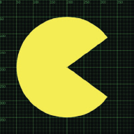
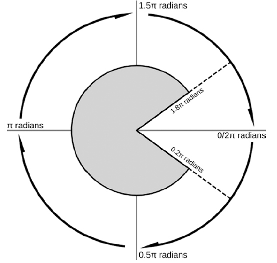
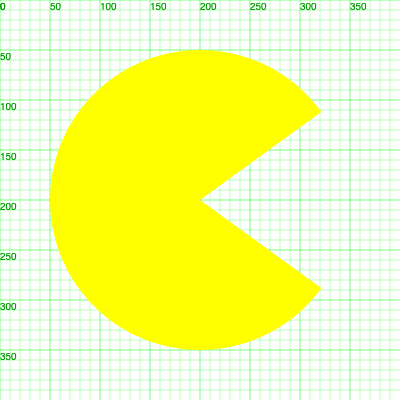

# Dibujando un diseño



Hasta ahora hemos visto cómo dibujar formas básicas en el canvas de HTML5. Hemos dibujado líneas, círculos, rectángulos, etc. Además, hemos aprendido a crear funciones para encapsular el código de dibujo y reutilizarlo en diferentes partes de nuestro programa.

En esta sección, vamos a aplicar lo que hemos aprendido para dibujar un diseño más complejo. Vamos a dibujar al personaje de un videojuego clásico: Pacman.

Empezaremos el proyecto desde cero, sin embargo implementaremos el Grid System del video que se dejó como actividad en el capítulo anterior. Si no has visto el video, te recomiendo que lo veas antes de continuar.

Link al video: [Cómo crear un Grid System - Canvas API](https://youtu.be/MLjpNAkJxCM?si=bYAI5tQPKT20x6J4)

## Creando la estructura del proyecto

Para empezar, crearemos una estructura de archivos y carpetas para nuestro proyecto. Crearemos un archivo HTML, un archivo CSS y un par de archivos JavaScript con la siguiente estructura:

```shell
pacman/
├── index.html
├── style.css
├── js/
│   ├── drawing.js
│   └── main.js
```

En el archivo `index.html` pondremos la estructura básica de un documento HTML, en el archivo `style.css` pondremos el estilo de la página y en los archivos `drawing.js` y `main.js` pondremos el código JavaScript.

<div style="background-color:black; color:white; width:70px; text-align:center;padding:4px; font-size:20px; font-family: sans-serif">Nota:</div>
> Vale aclarar que el archivo `drawing.js` contendrá las funciones e instrucciones para dibujar el canvas grid system, y por otro lado el archivo `main.js` contendrá las instrucciones para dibujar el diseño de Pacman.

## Código del proyecto

### index.html

```html
<!DOCTYPE html>
<html lang="en">
  <head>
    <title>Home</title>
    <meta charset="UTF-8" />
    <meta name="viewport" content="width=device-width" />
    <link rel="stylesheet" href="styles.css" />
  </head>
  <body>
    <canvas id="my-canvas" width="400" height="400"></canvas>
    <script src="js/drawing.js"></script>
    <script type="module" src="js/main.js"></script>
  </body>
</html>
```

- En el archivo `index.html` hemos creado un documento HTML básico con un canvas y enlaces a los archivos CSS y JavaScript.
- Como se puede observar ahora estamos usando la etiqueta `<script>` con el atributo `type="module"` para cargar el archivo `main.js` como un módulo de JavaScript. Esto evita que las variables y funciones definidas en `main.js` se filtren en el ámbito global, lo que puede causar conflictos con otras variables y funciones definidas en otros archivos.
- El archivo `drawing.js` se carga antes que `main.js` para que las funciones de dibujo estén disponibles cuando se cargue el archivo `main.js`.

### styles.css

```css
* {
  box-sizing: "border-box";
  margin: 0;
  padding: 0;
}
```

- En el archivo `styles.css` hemos definido un estilo básico para el documento.

### js/drawing.js

```javascript
const canvas = document.getElementById("my-canvas");
canvas.style.backgroundColor = "#000000";
const ctx = canvas.getContext("2d");

ctx.strokeStyle = "#00FF00";
ctx.lineWidth = 0.25;
ctx.fillStyle = "#009900";

for (let x = 0; x < canvas.width; x += 10) {
  ctx.beginPath();
  ctx.moveTo(x, 0);
  ctx.lineTo(x, canvas.height);
  ctx.lineWidth = x % 50 === 0 ? 0.5 : 0.25;
  ctx.stroke();
  if (x % 50 === 0) ctx.fillText(x, x, 10);
}

for (let y = 0; y < canvas.height; y += 10) {
  ctx.beginPath();
  ctx.moveTo(0, y);
  ctx.lineTo(canvas.width, y);
  ctx.lineWidth = y % 50 === 0 ? 0.5 : 0.25;
  ctx.stroke();
  if (y % 50 === 0) ctx.fillText(y, 0, y + 10);
}

function drawCoordinate(ctx, x, y) {
  ctx.fillStyle = "#00FF00";
  ctx.fillText(`(${x},${y})`, x, y);
}
```

- En el archivo `drawing.js` hemos definido un script que dibuja un grid system en el canvas.
- Hemos definido una función `drawCoordinate` que dibuja las coordenadas `(x, y)` en el canvas.
- La función `drawCoordinate` acepta tres parámetros: el contexto del canvas `ctx` y las coordenadas `x` e `y`.

### js/main.js

```javascript
// En este archivo pondremos el código para dibujar el diseño de Pacman
```

- En el archivo `main.js` pondremos el código para dibujar el diseño de Pacman.

## Pac-Man

De seguro estás familiarizado con el personaje de este videojuego, aunque si eres lo suficientemente joven, es posible que no lo conozcas. PacMan fue creado por el diseñador de videojuegos Toru Iwatani y lanzado por la empresa Namco en 1980. El personaje es un círculo amarillo con una boca que se abre y cierra para comer puntos y frutas en un laberinto. El objetivo del juego es comer todos los puntos y frutas sin ser atrapado por los fantasmas. Si eres atrapado, pierdes una vida y el videojuego termina cuando se acaban las vidas.


## Dibujando a Pac-Man

Imagina una flecha que comienza en el centro de un círculo y apunta hacia la derecha. Este es el ángulo cero (cero radianes). Al aumentar el ángulo, la flecha se mueve en el sentido de las agujas del reloj. Un ángulo de π radianes es la mitad de un círculo que apunta hacia la izquierda. Un ángulo de 2π radianes es una vuelta completa y la flecha apunta nuevamente hacia la derecha.



Para que la cara de Pac-Man quede bien, tenemos que empezar el arco con una cierta cantidad de radianes después de 0 (cero) y terminar el arco con el mismo ángulo antes de 2π. El ángulo total con la boca abierta es quizás un poco menos de un cuarto de vuelta (menos de 0,5π radianes), así que empecemos con 0,2π radianes (apuntando ligeramente hacia abajo a la derecha) y terminemos con 1,8π radianes (apuntando ligeramente hacia arriba a la derecha).

`js/main.js`

```javascript
ctx.beginPath();
ctx.arc(200, 200, 150, 0.2 * Math.PI, 1.8 * Math.PI);
ctx.lineTo(200, 200);
ctx.fillStyle = "yellow";
ctx.fill();
```



Este código debería resultarle familiar excepto por algunas líneas nuevas. Estamos usando el método `ctx.arc` para dibujar un arco con un radio de 150 píxeles, centrado en el punto `(200, 200)`, comenzando en `0,2π` radianes, en el sentido de las agujas del reloj a `1,8π` radianes. Para cortar la cuña, trazamos una línea hacia el centro. Luego configuramos el estilo de relleno en amarillo y rellenamos el trazado.

El resultado es un círculo amarillo con una boca abierta como podemos ver en la imagen anterior.

<div style="background-color:black; color:white; width:70px; text-align:center;padding:4px; font-size:20px; font-family: sans-serif">Nota:</div>
> El método `ctx.arc` puede tomar opcionalmente un parámetro booleano final para dibujar en sentido antihorario. Esto puede resultar conveniente cuando se utilizan arcos en rutas más complicadas.

## Refactorizando el código a una función

Como hemos podido observar, el código para dibujar un Pac-Man es bastante simple. Sin embargo, si queremos dibujar varios personajes Pac-Man en diferentes posiciones, tendríamos que repetir el mismo código varias veces. Ya hemos planteado que no es una buena práctica repetir el código, por lo que vamos a encapsular el código en una función para hacer el código más legible y reutilizable. Es decir, vamos a refactorizarlo en una función llamada `drawPacman`.

### Pasos para refactorizar el código

1. Definir una función llamada `drawPacman` que acepte los parámetros `x`, `y`,`radius` y `ctx`.
2. Mover el código de dibujo de Pac-Man a la función `drawPacman`.
3. Llamar a la función `drawPacman` con los valores adecuados.
4. Probar la función llamándola con diferentes valores.
5. Refactorizar el código para que sea más legible y reutilizable.
6. Añadir comentarios al código para explicar su funcionamiento. (Opcional)

`js/main.js`

```javascript
function drawPacman(x, y, radius, ctx) {
  ctx.beginPath();
  ctx.arc(x, y, radius, 0.2 * Math.PI, 1.8 * Math.PI);
  ctx.lineTo(x, y);
  ctx.fillStyle = "yellow";
  ctx.fill();
}

drawPacman(200, 200, 150, ctx);
```

- Hemos definido una función `drawPacman` que acepta cuatro parámetros: `x`, `y`, `radius` y `ctx`.
- Hemos movido el código de dibujo de Pac-Man a la función `drawPacman`.
- Hemos llamado a la función `drawPacman` con los valores adecuados para dibujarlo en el centro del canvas con un radio de 150 píxeles.

<div style="background-color:black; color:white; width:70px; text-align:center;padding:4px; font-size:20px; font-family: sans-serif">Nota:</div>
> Recordemos que el contexto `ctx` es una variable global que se definió en el archivo `drawing.js`. Es por eso que podemos acceder a ella desde nuestro archivo `main.js`.

## Creando Pac-Mans en diferentes posiciones de forma aleatoria

Ahora que hemos encapsulado el código de dibujo de Pac-Man en una función, podemos llamar a esta función con diferentes valores para dibujar varios personajes Pac-Man. Vamos a crear una función que dibuje varios Pac-Mans en diferentes posiciones de forma aleatoria.

### Pasos para crear Pac-Mans en diferentes posiciones

1. Definir una función llamada `drawRandomPacmans` que acepte los parámetros `n` y `ctx`.
2. Generar `n` posiciones aleatorias para los Pac-Mans.
3. Llamar a la función `drawPacman` con las posiciones generadas.
4. Probar la función llamándola con diferentes valores.
5. Refactorizar el código para que sea más legible y reutilizable.
6. Añadir comentarios al código para explicar su funcionamiento. (Opcional)

Añade el siguiente código al archivo `main.js`:

`js/main.js`

```javascript
function drawPacman(x, y, radius, ctx) {
  ctx.beginPath();
  ctx.arc(x, y, radius, 0.2 * Math.PI, 1.8 * Math.PI);
  ctx.lineTo(x, y);
  ctx.fillStyle = "yellow";
  ctx.fill();
}

function drawRandomPacmans(n, ctx) {
  for (let i = 0; i < n; i++) {
    const x = Math.floor(Math.random() * ctx.canvas.width);
    const y = Math.floor(Math.random() * ctx.canvas.height);
    const radius = Math.floor(Math.random() * 100) + 50;
    drawPacman(x, y, radius, ctx);
  }
}

drawRandomPacmans(5, ctx);
```

- Hemos definido una función `drawRandomPacmans` que acepta dos parámetros: `n` y `ctx`.
- Para ejecutar la función `drawPacman` n veces, hemos utilizado un bucle `for`.
- Dentro del ciclo `for`, hemos generado posiciones aleatorias para los Pac-Mans utilizando la función `Math.random()`. Generamos valores aleatorios para `x`, `y` y `radius` y llamamos a la función `drawPacman` con estos valores.
- Para generar números enteros aleatorios, hemos utilizado la función `Math.floor()` que redondea un número decimal hacia abajo al número entero más cercano y la función `Math.random()` que devuelve un número decimal aleatorio entre 0 y 1.

#### Math.random() y Math.floor()

La función `Math.random()` devuelve un número decimal aleatorio entre 0 y 1. Para obtener un número entero aleatorio entre dos valores, podemos multiplicar el resultado de `Math.random()` por la diferencia entre los dos valores y sumar el valor mínimo.

Por ejemplo, para obtener un número aleatorio para `x` entre 0 y el ancho del canvas, podemos hacer lo siguiente:

```javascript
const x = Math.floor(Math.random() * ctx.canvas.width);
//               0.008463111622209807 x  400
//                        3.3852446488839227
// aplicamos Math.floor(3.3852446488839227) para redondear hacia abajo ---> 3
```

De esta forma, `x` será un número entero aleatorio entre 0 y el ancho del canvas.
Este mismo procedimiento se aplica para `y` y `radius`.

Recordemos que `Math.floor()` redondea hacia abajo, por lo que si queremos redondear hacia arriba, podemos usar `Math.ceil()`.

## Resumen

En este capítulo hemos aprendido a dibujar un diseño más complejo en el canvas de HTML5. Hemos aplicado los conceptos de dibujo de formas básicas, creación de funciones y refactorización de código para dibujar al personaje de un videojuego.
Además, hemos aprendido a aplicar bucles `for` para dibujar múltiples personajes en diferentes posiciones de forma aleatoria.
Tambié hemos aprendido a utilizar las funciones `Math.random()` y `Math.floor()` para generar números aleatorios y redondearlos hacia abajo.
