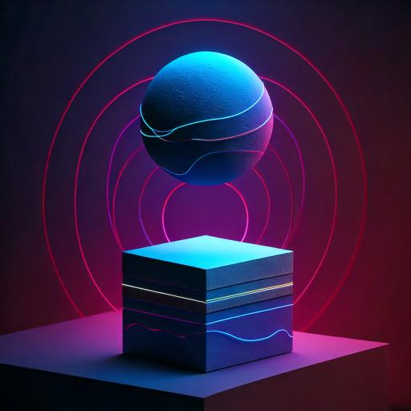

# Animaciones básicas



Hasta ahora y en los capítulos anteriores solo hemos dibujado figuras estáticas en el canvas. En este capítulo vamos a aprender a hacer animaciones básicas en el canvas de HTML5 logrando que las figuras se muevan en la pantalla.

La base de nuestras animaciones será bastante sencilla, basta con dibujar una escena cambiante varias veces por segundo, o como conocemos en la animación, dibujar una escena distinta en cada fotograma.

Hacerlo de esta manera tan simple nos ayudará a entender los conceptos básicos de las animaciones en el canvas y a partir de ahí podremos crear animaciones más complejas.

## Empecemos de forma sencilla

Cuando requerimos dibujar a nuestro personaje de Pac-Man en el capítulo anterior, requerimos brindarle una posición en la pantalla definiendo una posición `x` y `y` para dibujarlo. Si queremos que nuestro personaje se mueva, basta con cambiar la posición `x` y `y` en cada fotograma. A partir de ahora sería bueno referirnos a la posición `x` y `y` como la coordenada `x` y `y` de nuestro personaje.

Partiremos a partir del código que escribimos en el capitúlo anterior, solo que no usaremos la función `drawRandomPacmans` y en su lugar mantenemos la función `drawPacman` que dibuja al personaje.

Además, ya que tendremos que dibujar contantemente frames en el canvas, refactorizaremos el código que dibuja el Grid System en una función llamada `drawGridSystem` para que se ejecute en cada fotograma.

Modifica el código del archivo `drawing.js` de la siguiente manera:

```javascript
const canvas = document.getElementById("my-canvas");
canvas.style.backgroundColor = "#000000";
const ctx = canvas.getContext("2d");

function drawGridSystem() {
  ctx.strokeStyle = "#00FF00";
  ctx.lineWidth = 0.25;
  ctx.fillStyle = "#009900";

  for (let x = 0; x < canvas.width; x += 10) {
    ctx.beginPath();
    ctx.moveTo(x, 0);
    ctx.lineTo(x, canvas.height);
    ctx.lineWidth = x % 50 === 0 ? 0.5 : 0.25;
    ctx.stroke();
    if (x % 50 === 0) ctx.fillText(x, x, 10);
  }

  for (let y = 0; y < canvas.height; y += 10) {
    ctx.beginPath();
    ctx.moveTo(0, y);
    ctx.lineTo(canvas.width, y);
    ctx.lineWidth = y % 50 === 0 ? 0.5 : 0.25;
    ctx.stroke();
    if (y % 50 === 0) ctx.fillText(y, 0, y + 10);
  }
}

function drawCoordinate(ctx, x, y) {
  ctx.fillStyle = "#00FF00";
  ctx.fillText(`(${x},${y})`, x, y);
}
```

- Como podemos ver, hemos movido el código que dibuja el Grid System a una función llamada `drawGridSystem`.

### Pasos para crear una animación básica

1. Definir la posición inicial del personaje usando variables `x` y `y`.
2. Definir una función llamada `draw` que acepte los parámetros `x`, `y`, `radius` y `ctx`.
3. Definir una función llamada `updatePosition` que actualice la posición del personaje.
4. Definir una función llamada `drawFrame` que llame a la función `draw` y `updatePosition`.
5. Ejecutar un setInterval que llame a la función `drawFrame` por 60 fpd (fotogramas por segundo).

```javascript
let x = 50;
let y = 50;
let radius = 50;

function drawPacman(x, y, radius, ctx) {
  ctx.beginPath();
  ctx.arc(x, y, radius, 0.2 * Math.PI, 1.8 * Math.PI);
  ctx.lineTo(x, y);
  ctx.fillStyle = "yellow";
  ctx.fill();
}

function updatePosition() {
  x += 1;
}

function drawFrame() {
  ctx.clearRect(0, 0, canvas.width, canvas.height);
  drawGridSystem();
  drawPacman(x, y, radius, ctx);
  updatePosition();
}

setInterval(drawFrame, 1000 / 60);
```

- Hemos definido una variable `x` y `y` que representan la posición inicial del personaje.
- Hemos definido una variable `radius` que representa el radio del personaje.
- Hemos definido una función `drawPacman` que dibuja al personaje en la posición `x` y `y` con un radio `radius`.
- Hemos definido una función `updatePosition` que actualiza la posición del personaje sumando 1 a la posición `x` inicial.
- Hemos definido una función `drawFrame` que limpia el canvas, dibuja el Grid System, dibuja al personaje y actualiza su posición.
- Hemos ejecutado un setInterval que llama a la función `drawFrame` 60 veces por segundo.

Puedes ver la animación en acción en el siguiente Link:

[Ver animación básica](https://youtube.com/shorts/_Hx64ftPoqs?si=ScURTk9nOUD6djca)

<div style="background-color:black; color:white; width:70px; text-align:center;padding:4px; font-size:20px; font-family: sans-serif">Nota:</div>

> Hemos elegido 60 fpd (fotogramas por segundo) como la tasa de refresco de nuestra animación. Esto significa que la función `drawFrame` se ejecutará 60 veces por segundo, lo que dará la impresión de que el personaje se está moviendo suavemente. La razón por la que dividimos 1000 entre 60 es porque queremos que la función se ejecute cada 16.6666666667 milisegundos. Esto es aproximadamente 60 veces por segundo.

## Creando una animación más compleja

Hasta ahora hemos logrado que nuestro personaje se mueva en una dirección, pero ¿qué pasa si queremos que se mueva en diferentes direcciones? Para lograr esto, necesitamos definir una velocidad en las direcciones `x` y `y` y actualizar la posición del personaje en cada fotograma.

Además, nuestro personaje debería abrir y cerrar su boca mientras se mueve. Para lograr esto, necesitamos definir un ángulo de apertura y cierre de la boca y actualizar este ángulo en cada fotograma.

También deberíamos definir un límite para la posición del personaje para que no se salga del canvas. Si el personaje llega al límite, este debería detenerse e invertir su dirección. Para lograr esto, necesitamos definir un límite en las direcciones `x` y `y` y verificar si el personaje ha llegado a estos límites en cada fotograma.

Todo esto puede sonar complicado, pero si lo desglosamos en pasos más pequeños, podemos lograrlo fácilmente. Esto es un principio fundamental del pensamiento computacional: dividir un problema en partes más pequeñas y resolver cada parte por separado.

### Principios del pensamiento computacional

Hemos llegado a un punto en el cual necesitamos pensar en cómo resolver un problema más complejo. Para lograrlo, necesitamos aplicar los principios del pensamiento computacional. Estos principios son:

1. **Descomposición:** Dividir un problema en partes más pequeñas.
2. **Reconocimiento de patrones:** Identificar similitudes entre problemas.
3. **Abstracción:** Ignorar los detalles irrelevantes y enfocarse en los detalles importantes.
4. **Algoritmos:** Crear una serie de pasos para resolver un problema.

Este curso no solo trata de enseñarte a programar, sino también de enseñarte a pensar como un programador. Si aplicas estos principios a cualquier problema que enfrentes, podrás resolverlo de manera más eficiente. Sin embargo, no abordaremos estos principios en detalle en este curso, pero es importante que los tengas en cuenta y que puedas profundizarlos por tu cuenta o acceder a un curso.

### Pasos para crear una animación más compleja aplicando los principios del pensamiento computacional

En primer lugar hemos planteado un problema más complejo y a grandes razgos al inicio de esta sección. Ahora vamos a dividir este problema en partes más pequeñas y resolver cada parte por separado.

#### Hacer que el personaje abra y cierre la boca mientras se mueve

Hemos extraido este problema más pequeño del problema inicial, el cual es más general. Para lograr que el personaje abra y cierre la boca mientras se mueve, necesitamos definir un ángulo de apertura y cierre de la boca y actualizar este ángulo en cada fotograma.

1. Definir un ángulo de apertura y cierre de la boca.
2. Definir una velocidad de apertura y cierre de la boca.
3. Actualizar el ángulo de apertura y cierre de la boca en cada fotograma.
4. Dibujar al personaje con la boca abierta o cerrada dependiendo del ángulo de apertura y cierre de la boca.

```javascript
let x = 50;
let y = 50;
let radius = 50;
let mouthAngle = 0;
let mouthSpeed = 0.1;

function drawPacman(x, y, radius, mouthAngle, ctx) {
  ctx.beginPath();
  ctx.arc(x, y, radius, 0 + mouthAngle, 2 * Math.PI - mouthAngle);
  ctx.lineTo(x, y);
  ctx.fillStyle = "yellow";
  ctx.fill();
}

function updateMouth() {
  mouthAngle += mouthSpeed;
  if (mouthAngle > 0.8 || mouthAngle < 0) mouthSpeed *= -1;
}

function updatePosition() {
  x += 1;
}

function drawFrame() {
  ctx.clearRect(0, 0, canvas.width, canvas.height);
  drawGridSystem();
  drawPacman(x, y, radius, mouthAngle, ctx);
  updatePosition();
  updateMouth();
}

setInterval(drawFrame, 1000 / 60);
```

- El mecanismo para abrir y cerrar la boca de Pacman en el código presentado se basa en el control del ángulo de la boca mediante una animación continua, controlada por la variable `mouthAngle` y su velocidad de cambio, `mouthSpeed`. A continuación veremos cómo funciona este mecanismo en detalle.

##### Variables principales

- `x, y`: Estas variables representan la posición de Pacman en el lienzo (canvas). Inicialmente, Pacman empieza en la posición `(50, 50)`.
- `radius`: Este es el radio del círculo que representa el cuerpo de Pacman.
- `mouthAngle`: Es la variable que controla la apertura de la boca. Inicialmente, está en 0, lo que significa que la boca está completamente cerrada.
- `mouthSpeed`: Controla la velocidad a la que se abre y cierra la boca. En este caso, se le asigna un valor de 0.1, lo que significa que en cada frame, el ángulo de la boca aumenta en 0.1 radianes.
- Función `drawPacman(x, y, radius, mouthAngle, ctx)`: Esta función se encarga de dibujar a Pacman en el lienzo del navegador.
- `ctx.beginPath()`: Comienza un nuevo trazo en el lienzo.
- `ctx.arc(x, y, radius, 0 + mouthAngle, 2 * Math.PI - mouthAngle)`: Este es el paso clave que crea el cuerpo de Pacman, que en realidad es un círculo (arc), pero la boca se representa como un arco angular. El ángulo de inicio de la boca está controlado por 0 + mouthAngle y el ángulo de fin está controlado por 2 \* Math.PI - mouthAngle.
- `mouthAngle`: Cuanto mayor sea este valor, más grande será la apertura de la boca. Cuando el valor es 0, la boca está completamente cerrada. Cuando el valor es grande, Pacman tiene la boca completamente abierta.
  Al controlar estos ángulos, se ajusta el tamaño del arco y se simula que la boca de Pacman se abre o cierra.
- `ctx.lineTo(x, y)`: Esto dibuja una línea desde el borde de la apertura de la boca hasta el centro de Pacman, cerrando el "corte" que representa su boca.
- `ctx.fillStyle = 'yellow'`: Asigna el color amarillo a Pacman.
- `ctx.fill()`: Finalmente, rellena el área con el color amarillo, completando el dibujo de Pacman.
- Función `updateMouth()`: Esta función controla cómo cambia el ángulo de la boca (y por lo tanto la apertura y cierre de la boca) en cada frame de la animación.
- `mouthAngle += mouthSpeed`: En cada llamada a updateMouth(), el valor de mouthAngle aumenta en mouthSpeed. Como mouthSpeed tiene un valor positivo, el ángulo se incrementa en cada frame, lo que abre la boca gradualmente.

- Condición `if (mouthAngle > 0.8 || mouthAngle < 0)`: Esta condición asegura que la boca de Pacman no se abra demasiado o no se cierre por completo y permanece en un rango adecuado: - Si mouthAngle supera 0.8: Esto significa que la boca ha alcanzado un ángulo amplio de apertura, y es el momento de invertir la dirección del movimiento (es decir, empezar a cerrarla). Para lograrlo, el valor de mouthSpeed se multiplica por -1, lo que hace que el ángulo empiece a disminuir en el siguiente frame. - Si mouthAngle es menor que 0: Esto significa que la boca está completamente cerrada. Nuevamente, se invierte el valor de mouthSpeed para empezar a abrir la boca.
  Este ciclo de inversión del mouthSpeed es lo que crea el efecto de apertura y cierre continuo de la boca de Pacman.

- Función `updatePosition()`: Esta función simplemente incrementa la posición horizontal (x) de Pacman, lo que hace que Pacman se desplace hacia la derecha en el lienzo mientras abre y cierra la boca.

- Función `drawFrame()`: Es la función que se ejecuta periódicamente para actualizar el lienzo con el nuevo estado de Pacman.

- `ctx.clearRect(0, 0, canvas.width, canvas.height)`: Limpia el lienzo antes de cada frame para evitar que se dibuje sobre el dibujo anterior.
- `drawPacman(x, y, radius, mouthAngle, ctx)`: Dibuja a Pacman con el ángulo de la boca actualizado.
- `updatePosition()`: Actualiza la posición de Pacman. -`updateMouth()`: Actualiza el ángulo de la boca, lo que provoca que se abra o se cierre dependiendo del valor actual de mouthAngle.

###### Ciclo de Animación

La función `setInterval(drawFrame, 1000 / 60)` se asegura de que la función `drawFrame()` se ejecute 60 veces por segundo, lo que genera la animación fluida de Pacman moviéndose y abriendo/cerrando la boca.

##### Resumen del Comportamiento de la Boca de Pac-Man

Cuando el `mouthAngle` es pequeño (cerca de 0), la boca está casi completamente cerrada.
A medida que mouthAngle aumenta, la boca se abre más.
Cuando mouthAngle llega a `0.8` (que equivale a un ángulo de unos `45 grados` en cada lado del círculo), la boca comienza a cerrarse nuevamente.
Este ciclo se repite indefinidamente, creando la ilusión de que Pacman abre y cierra la boca mientras se mueve hacia la derecha.
Este código crea un simple pero efectivo mecanismo para simular la boca de Pacman abriéndose y cerrándose continuamente en una animación fluida.

## Resumen

En este capítulo hemos aprendido a crear animaciones básicas en el canvas de HTML5. Hemos aprendido a dibujar una escena cambiante varias veces por segundo, lo que nos permite crear animaciones simples en el canvas.

Hemos aprendido a hacer que un personaje se mueva en la pantalla cambiando su posición `x` y `y` en cada fotograma. También hemos aprendido a hacer que un personaje abra y cierre la boca mientras se mueve, lo que nos permite crear animaciones más interesantes.

Como podrás ver, se nos han quedado muchas cosas por resolver, sin embargo las veremos en el siguiente capítulo ya que abordaremos interacciones con el usuario y eventos del teclado para controlar la animación de nuestro personaje.

## Actividad propuesta

Nuestro personaje ha logrado un cierto dinamismo al abrir y cerrar la boca mientras se mueve. Te recomiendo implementar este código desde cero y lograr llegar hasta este punto escribiendo el código tú mismo.

Además, te propongo que dibujes el ojo de Pacman en el círculo amarillo. Puedes hacerlo dibujando un círculo blanco en la parte superior izquierda del círculo amarillo. Para lograrlo, necesitarás definir la posición del ojo en función de la posición de Pacman y dibujar el círculo de un color diferente en esa posición.

Ten en cuenta que el ojo debe moverse junto con Pacman, por lo que necesitarás actualizar su posición en cada fotograma y esta posición debe ser relativa a la posición de Pacman.
