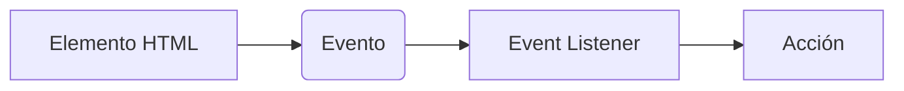
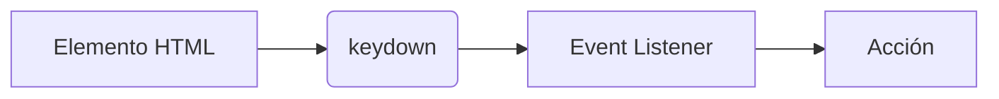
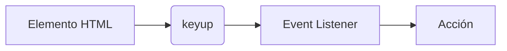

# Interactividad

Les doy la bienvenida a uno de los capítulos más interesantes de este curso. Sin duda disfrutarás ver como tus creaciones cobran vida y responden a las acciones del usuario. Ahora ya sabes cómo crear elementos en el Canvas, cómo dibujar formas y cómo animarlas. En este capítulo aprenderás a hacer que el usuario pueda interactuar con tus creaciones, haciendo que el personaje de Pac-Man se mueva con las flechas del teclado. Además, aprenderás a detectar colisiones entre objetos como las paredes del canvas para que el personaje no se salga de la pantalla.

## Eventos

Antes que nada, para desarrollar la interactividad con el usuario es necesario que revisemos algunos conceptos clave como los Eventos. Un evento es cualquier suceso que ocurre en el navegador, ya sea por parte del usuario o por parte del sistema. Por ejemplo, un evento puede ser el clic de un botón, el movimiento del mouse, el presionar una teclal, incluso cuando el navegador termina de cargar una página.

Algunos eventos muy comunes en el desarrollo web son los siguientes:

- **click**: Este evento se dispara cuando el usuario hace clic en un elemento.
- **mouseover**: Este evento se dispara cuando el usuario pasa el mouse sobre un elemento.
- **keydown**: Este evento se dispara cuando el usuario presiona una tecla.
- **keyup**: Este evento se dispara cuando el usuario suelta una tecla.
- **load**: Este evento se dispara cuando la página ha terminado de cargar.
- **resize**: Este evento se dispara cuando el usuario cambia el tamaño de la ventana del navegador.
- **scroll**: Este evento se dispara cuando el usuario hace scroll en la página.
- **submit**: Este evento se dispara cuando el usuario envía un formulario.
- **input**: Este evento se dispara cuando el usuario escribe en un campo de texto.
- **change**: Este evento se dispara cuando el usuario cambia el valor de un campo de texto.

Estos son algunos eventos que puedes "escuchar" en tu página web. Los desarrolladores web preparan instrucciones a través de código para que el navegador ejecute ciertas acciones cuando ocurra un evento.

## Teclado, mouse y touch (táctil)

Como primer paso, separaremos los eventos que nos darán interactividad con el usuario en tres categorías: teclado, mouse y touch (táctil). Para cada una de estas categorías, existen eventos específicos que nos permiten detectar la interacción del usuario con nuestra página web.

### Escuchando eventos

Como hemos dicho, los eventos son sucesos que ocurren en el navegador con o sin intervención del usuario y sin necesidad de que los detectemos. Sin embargo, si queremos reaccionar a estos eventos y ejecutar ciertas acciones, debemos "escucharlos" o "detectarlos" en nuestro código. Es aquí donde entra en juego el concepto de "escuchadores de eventos" o "event listeners".

El siguiente gráfico muestra como se relacionan los eventos, los elementos HTML y los event listeners:



Como puedes ver, un evento ocurre en un elemento HTML, el event listener está "escuchando" ese evento y cuando ocurre, se ejecuta una acción. Recordemos que es necesario capturar el nodo del elemento HTML para poder trabajar con él en JavaScript.

### Capturando eventos del teclado

Como hemos planteado anteriormente, estamos en la búsqueda de la interactividad con el usuario y especialmente queremos que cuando el usuario presione una tecla, nuestro personaje de Pac-Man cambie de dirección. Para ello, necesitamos capturar los eventos del teclado. En JavaScript, los eventos del teclado se capturan con los eventos `keydown` y `keyup`. El evento `keydown` se dispara cuando el usuario presiona una tecla y el evento `keyup` se dispara cuando el usuario suelta una tecla.





Vamos a ver un ejemplo de cómo capturar los eventos del teclado en JavaScript, para ello simplemte crearemos un documento HTML en el que capturaremos el body de la página y añadiremos un event listener para el evento `keydown` y `keyup`.

```html
<!DOCTYPE html>
<html lang="es">
  <head>
    <meta charset="UTF-8" />
    <meta name="viewport" content="width=device-width, initial-scale=1.0" />
    <title>Eventos del teclado</title>
  </head>
  <body>
    <script>
      document.body.addEventListener("keydown", (event) => {
        console.log("Tecla presionada:", event.key);
      });

      document.body.addEventListener("keyup", (event) => {
        console.log("Tecla liberada:", event.key);
      });
    </script>
  </body>
</html>
```

Puedes probar este código creando un archivo HTML y abriéndolo ejecutándolo con live server o simplemente abriéndolo en tu navegador. Al presionar una tecla, verás en la consola del navegador el mensaje "Tecla presionada: [tecla]" y al soltar la tecla, verás el mensaje "Tecla liberada: [tecla]".

Por ejemplo, si presionamos y soltamos la tecla "a", veremos en la consola del navegador los mensajes:

```shell
Tecla presionada: a
Tecla liberada: a
```

Para nuestro juego de Pac-Man necesitamos capturar las teclas de dirección, si presionamos la tecla de flecha hacia arriba, abajo, izquierda o derecha, veremos en la consola del navegador los mensajes:

```shell
Tecla presionada: ArrowUp
Tecla liberada: ArrowUp
```

```shell
Tecla presionada: ArrowDown
Tecla liberada: ArrowDown
```

```shell
Tecla presionada: ArrowLeft
Tecla liberada: ArrowLeft
```

```shell
Tecla presionada: ArrowRight
Tecla liberada: ArrowRight
```

#### Sintaxis de los addEventListener

La función `addEventListener` es un método propio de los nodos del DOM que previamente hemos capturado con `document.querySelector` o `document.getElementById`. La sintaxis de `addEventListener` es la siguiente:

```javascript
elemento.addEventListener(evento, callback);
```

Donde:

- `elemento`: Es el nodo del DOM al que queremos añadir el event listener.
- `evento`: Es el nombre del evento que queremos escuchar.
- `callback`: Es la función que se ejecutará cuando ocurra el evento.

<div style="background-color:black; color:white; width:70px; text-align:center;padding:4px; font-size:20px; font-family: sans-serif">Nota:</div>
> Un `callback` es una función que se pasa como argumento o parámetro a otra función y que se ejecuta dentro de la función que la recibe. Los callbacks son muy comunes en JavaScript y se utilizan para ejecutar código de manera asíncrona ya que podemos pasar una función como argumento a otra función y ejecutarla en un momento posterior o cuando se cumpla cierta condición.

#### Anatomía del `callback` que se ejecuta en el `addEventListener`

El `callback` que se ejecuta en el `addEventListener` recibe un parámetro que es el evento que ha ocurrido. Este evento es un objeto que contiene información sobre el evento que ha ocurrido.

Como podrás ver en el ejemplo anterior, la forma de la función `callback` es un poco diferente a lo que hemos visto anteriormente. En lugar de utilizar la palabra reservada `function`, hemos utilizado una función flecha `() => {}`. Esta es una forma más moderna de definir funciones en JavaScript y es equivalente a la forma tradicional de definir funciones. La función flecha tiene la siguiente forma:

```javascript
(parametro1, parametro2, ..., parametroN) => {
  // Código de la función
}
```

Donde:

- `parametro1, parametro2, ..., parametroN`: Son los parámetros que recibe la función.
- `{}`: Es el cuerpo de la función que contiene el código que se ejecutará.
- `=>`: Es el operador de flecha que indica que estamos definiendo una función flecha.
- `// Código de la función`: Es el código que se ejecutará cuando se llame a la función.

##### Funciones flecha vs funciones tradicionales

Las funciones flecha son una forma más moderna de definir funciones en JavaScript y tienen algunas diferencias con las funciones tradicionales.

Ejemplo de función tradicional:

```javascript
document.body.addEventListener("keydown", function (event) {
  console.log("Tecla presionada:", event.key);
});
```

Ejemplo de función flecha:

```javascript
document.body.addEventListener("keydown", (event) => {
  console.log("Tecla presionada:", event.key);
});
```

###### La función flecha es anónima

Las funciones flecha son funciones anónimas, es decir, no tienen un nombre. Esto significa que no podemos llamar a una función flecha por su nombre, sino que debemos asignarla a una variable o pasarla como argumento a otra función. Para resolver este problema, podemos asignar la función flecha a una variable.

El siguiente ejemplo muestra cómo asignar una función flecha a una variable:

```javascript
const miFuncion = (parametro1, parametro2) => {
  console.log(parametro1, parametro2);
};

miFuncion("Hola", "Mundo");
```

##### Si la función flecha se escribe en una sola línea, no es necesario utilizar `{}` y `return`

Si la función flecha se escribe en una sola línea, no es necesario utilizar `{}` y `return`. En este caso, la función flecha devolverá el valor de la expresión que se encuentra a la derecha de `=>`.

El siguiente ejemplo muestra cómo escribir una función flecha en una sola línea:

```javascript
const sumar = (a, b) => a + b;

console.log(sumar(2, 3)); // 5
```

- Como podemos ver, la función flecha `sumar` recibe dos parámetros `a` y `b` y devuelve la suma de `a` y `b`. En este caso, la función flecha se escribe en una sola línea y no es necesario utilizar `{}` y `return`. Se dice entonces que el `return` es implícito.

##### Si la función flecha recibe un solo parámetro, no es necesario utilizar `()`

Si la función flecha recibe un solo parámetro, no es necesario utilizar `()`. En este caso, la función flecha se escribe de la siguiente forma:

```javascript
const duplicar = (numero) => numero * 2;

console.log(duplicar(5)); // 10
```

#### El objeto `event` que recibe el `callback` como parámetro

El objeto `event` que recibe el `callback` como parámetro contiene información sobre el evento que ha ocurrido. Este objeto tiene las siguientes propiedades y varía dependiendo del tipo de evento que se haya producido. Algunas de las propiedades más comunes del objeto `event` para los eventos del teclado son las siguientes:

- `event.key`: Es la tecla que se ha presionado o liberado.
- `event.code`: Es el código de la tecla que se ha presionado o liberado.
- `event.ctrlKey`: Indica si la tecla `Control` está presionada.
- `event.shiftKey`: Indica si la tecla `Shift` está presionada.
- `event.altKey`: Indica si la tecla `Alt` está presionada.
- `event.metaKey`: Indica si la tecla `Meta` está presionada.

Por ejemplo, si presionamos la tecla "a", el objeto `event` tendrá las siguientes propiedades:

```javascript
{
  key: "a",
  code: "KeyA",
  ctrlKey: false,
  shiftKey: false,
  altKey: false,
  metaKey: false
}
```


