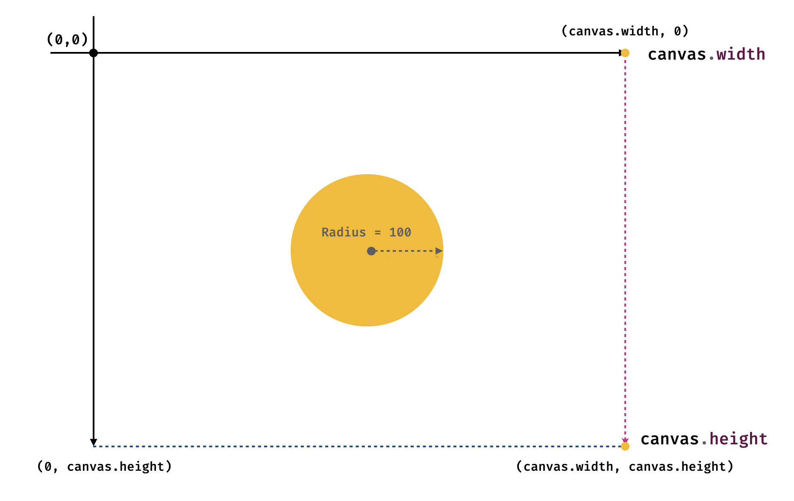
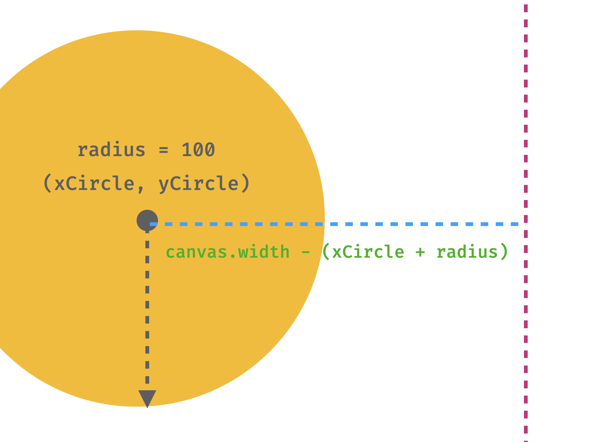

# Detectando colisiones

En este capítulo vamos a aprender a detectar colisiones entre distintos objetos creados o representados en nuestro Canvas. Para ello, veremos una serie de técnicas y métodos que nos permitirán saber si dos objetos se han tocado o no.

## Consideraciones previas

Para entender a ciencia cierta como se detectan las colisiones en un juego o en este caso, dentro del canvas, es necesario tener siempre en cuenta que todos los objetos tienen los siguientes atributos:

- **Posición**: La posición de un objeto en el canvas se refiere a la ubicación en la que se encuentra en un momento dado. Esta posición se mide en píxeles y se representa mediante un par de coordenadas (x, y).
- **Dimensiones**: Las dimensiones de un objeto se refieren al tamaño que tiene en el canvas. Estas dimensiones también se miden en píxeles y se representan mediante un par de valores (ancho, alto).
- **Forma**: La forma de un objeto se refiere a la figura geométrica que representa. En el caso de nuestro canvas, los objetos pueden ser rectángulos o círculos.

Estos atributos son fundamentales para poder detectar colisiones entre objetos, ya que nos permiten saber si dos objetos se han tocado o no. Vamos a poner como primer ejemplo nuestro personaje de Pac-Man y las paredes del canvas.



Como podemos ver en la imagen, la ordenada al origen de nuestro canvas se encuentra en la parte superior izquierda, por lo que el eje `y` crece hacia abajo. Por otro lado, la abscisa al origen se encuentra en la parte superior izquierda, por lo que el eje `x` crece hacia la derecha.

Por otro lado, nuestro Pac-Man está representado por un círculo, mientras que las paredes del canvas están representadas por rectángulos. Para detectar si nuestro personaje ha chocado con una pared, debemos tener en cuenta la posición, las dimensiones y la forma de ambos objetos.

## Detectando colisiones entre círculos y rectángulos

Nuestro Pac-Man es un círculo cuyo centro se encuentra en la posición `(xCircle, yCircle)` y cuyo radio es `radius = 100`. Por otro lado, las paredes del canvas son rectángulos cuyas posiciones se encuentran en las coordenadas `(0,0)`, `(0, canvas.height)`, `(canvas.width, 0)` y `(canvas.width, canvas.height)`.

Para detectar si nuestro Pac-Man ha chocado con una pared, debemos tener en cuenta que un círculo y un rectángulo se tocan si la distancia entre el centro del círculo y el borde del rectángulo es menor o igual al radio del círculo. En otras palabras, si la distancia entre el centro del círculo y el borde del rectángulo es menor o igual al radio del círculo, entonces los dos objetos se han tocado.



Como podemos observar en este gráfico, la distancia entre el circulo y la pared derecha del canvas está dada por la formula `distancia = canvas.width - (xCircle + radius)`. Si esta distancia es menor o igual a cero, entonces nuestro Pac-Man ha chocado con la pared derecha del canvas.

Otra forma forma de detectar la colisión entre el Pac-Man y la pared derecha del canvas es mediante la siguiente fórmula:

```javascript
if (xCircle + radius >= canvas.width) {
    // Colisión detectada
}
```

Esta fórmula nos permite detectar si el borde derecho del círculo ha superado el borde derecho del canvas, lo que significa que nuestro Pac-Man ha chocado con la pared derecha del canvas.


De igual forma, podemos detectar la colisión entre el Pac-Man y la pared izquierda del canvas mediante la siguiente fórmula:

```javascript
if (xCircle - radius <= 0) {
    // Colisión detectada
}
```

Esta fórmula nos permite detectar si el borde izquierdo del círculo ha superado el borde izquierdo del canvas. Recordemos que la posición del círculo se mide desde el centro del círculo, por lo que debemos restar el radio del círculo a la posición `x` del círculo para obtener la posición de su borde izquierdo.


### Actividad 

Usando esta misma lógica, ¿cómo detectarías la colisión entre el Pac-Man y las paredes superior e inferior del canvas? ¿Qué fórmulas utilizarías para detectar estas colisiones?

Puedes escribir tus respuestas usando un if en JavaScript. No avances al siguiente tema hasta que hayas intentado responder a esta pregunta.

```javascript
if ( ????????? ) {
    // Colisión detectada con la pared superior
}

if ( ????????? ) {
    // Colisión detectada con la pared inferior
}
```

En caso de que no puedas responder a esta pregunta, no te preocupes. En la siguiente sección veremos como aplicar esta lógica para detectar colisiones entre el Pac-Man y todas las paredes del canvas.

## Aplicando la lógica de colisiones en nuestro juego

Ahora que sabemos cómo detectar colisiones entre un círculo y un rectángulo, vamos a aplicar esta lógica en nuestro juego. Para ello, vamos a crear una función que se ejecute en cada frame del juego verificando si nuestro personaje ha chocado con alguna de las paredes del canvas.

```javascript
function detectCollision(xCircle, yCircle, radius, canvas, direction) {
  if (xCircle + radius >= canvas.width && direction === "ArrowRight") {
    // Colisión detectada con la pared derecha
    return true;
  }

  if (xCircle - radius <= 0 && direction === "ArrowLeft") {
    // Colisión detectada con la pared izquierda
    return true;
  }

  if (yCircle + radius >= canvas.height && direction === "ArrowDown") {
    // Colisión detectada con la pared inferior
    return true;
  }

  if (yCircle - radius <= 0 && direction === "ArrowUp") {
    // Colisión detectada con la pared superior
    return true;
  }

  return false;
}  
```

Esta función se encarga de verificar si nuestro personaje, el cual está representado por un círculo, ha chocado con alguna de las paredes del canvas. Si detecta una colisión, entonces podemos ejecutar una acción específica, como reiniciar el juego o mostrar un mensaje de error. Sin embargo en nuestro caso, simplemente evitaremos que el Pac-Man siga avanzando en la dirección de la colisión. Es por eso que también debemos considerar la dirección en la que se está moviendo nuestro personaje, ya que de lo contrario, nuestro personaje no podría moverse en los bordes del canvas. 

Es decir, nuestro personaje podrá moverse tocando las paredes del canvas siempre y cuando no sea en la dirección de la colisión. Si nuestro personaje choca con una pared, entonces simplemente evitaremos que siga avanzando en la dirección de la colisión.

Vamos a hacerlo funcionar en nuestro juego, para ello mantendremos la misma estructura de nuestro juego anterior, pero añadiremos la función `detectCollision` en cada frame del juego.

```javascript
let x = 50;
let y = 50;
let radius = 50;
let mouthAngle = 0;
let mouthSpeed = 0.1;
let direction = "ArrowRight";
let on = false;
const startButton = document.querySelector(".start-button");

// events
document.body.addEventListener("keydown", (e) => {
  console.log("event", e.key);
  if (
    e.key === "ArrowUp" ||
    e.key === "ArrowDown" ||
    e.key === "ArrowLeft" ||
    e.key === "ArrowRight"
  ) {
    direction = e.key;
  }
});

startButton.addEventListener("click", (e) => {
  on = !on;
  if (on) {
    startButton.textContent = "Stop";
  } else {
    startButton.textContent = "Start";
  }
});

// Funciones

function drawPacman(x, y, radius, mouthAngle, ctx) {
  ctx.save(); // Guarda el estado actual del contexto

  // Mueve el origen al centro de Pac-Man
  ctx.translate(x, y);

  // Calcula el ángulo de rotación según la dirección
  let rotationAngle;
  switch (direction) {
    case "ArrowDown":
      rotationAngle = Math.PI / 2; // 90 grados
      break;
    case "ArrowUp":
      rotationAngle = -Math.PI / 2; // -90 grados
      break;
    case "ArrowLeft":
      rotationAngle = Math.PI; // 180 grados
      break;
    case "ArrowRight":
    default:
      rotationAngle = 0; // Sin rotación para la derecha
      break;
  }

  ctx.rotate(rotationAngle); // Rota el contexto en el ángulo deseado

  // Dibuja el Pac-Man en su dirección
  ctx.beginPath();
  ctx.arc(0, 0, radius, mouthAngle, 2 * Math.PI - mouthAngle);
  ctx.lineTo(0, 0);
  ctx.fillStyle = "yellow";
  ctx.fill();

  ctx.restore(); // Restaura el contexto para que no afecte otros dibujos
}

function updateMouth() {
  mouthAngle += mouthSpeed;
  if (mouthAngle > 0.8 || mouthAngle < 0) mouthSpeed *= -1;
}

function updatePosition() {
  if (detectCollision(x, y, radius, canvas, direction)) {
    return;
  }
  switch (direction) {
    case "ArrowRight":
      x += 1;
      break;
    case "ArrowLeft":
      x -= 1;
      break;
    case "ArrowDown":
      y += 1;
      break;
    case "ArrowUp":
      y -= 1;
      break;
    default:
      console.warn("direction no coincide con ninguno de los casos");
      break;
  }
}

function detectCollision(xCircle, yCircle, radius, canvas, direction) {
  if (xCircle + radius >= canvas.width && direction === "ArrowRight") {
    // Colisión detectada con la pared derecha
    return true;
  }

  if (xCircle - radius <= 0 && direction === "ArrowLeft") {
    // Colisión detectada con la pared izquierda
    return true;
  }

  if (yCircle + radius >= canvas.height && direction === "ArrowDown") {
    // Colisión detectada con la pared inferior
    return true;
  }

  if (yCircle - radius <= 0 && direction === "ArrowUp") {
    // Colisión detectada con la pared superior
    return true;
  }

  return false;
}

function drawFrame() {
  ctx.clearRect(0, 0, canvas.width, canvas.height);
  drawGridSystem(); // Dibuja el fondo si tienes un sistema de cuadrícula
  drawPacman(x, y, radius, mouthAngle, ctx);
  updatePosition();
  updateMouth();
}

// bucle principal
setInterval(() => {
  if (on) drawFrame();
}, 1000 / 60);
```

Lo que hemos hecho en este código es añadir la función `detectCollision` en la función `updatePosition` para verificar si nuestro personaje ha chocado con alguna de las paredes del canvas. Si detecta una colisión, entonces evitamos que el personaje siga avanzando en la dirección de la colisión. Es por eso que usamos un `return` para salir de la función `updatePosition` si detectamos una colisión.


