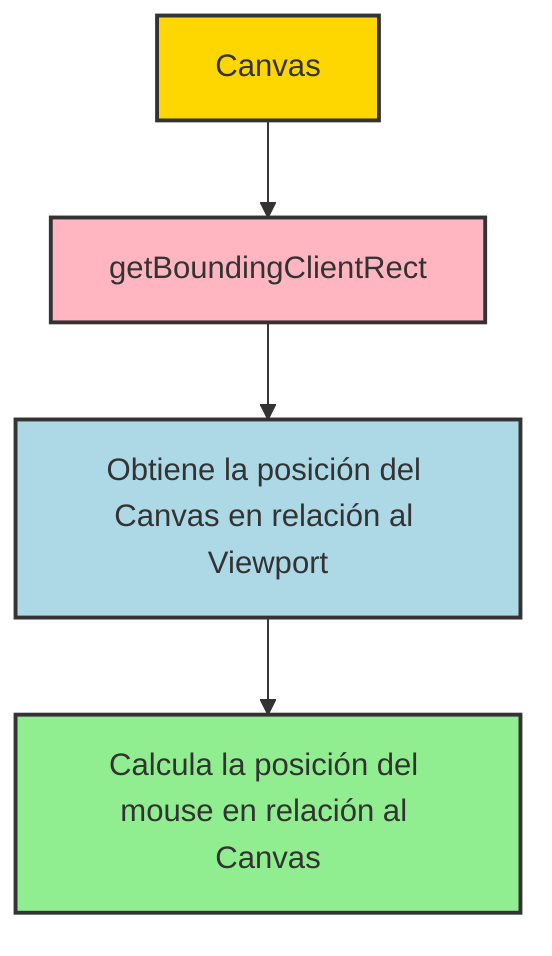
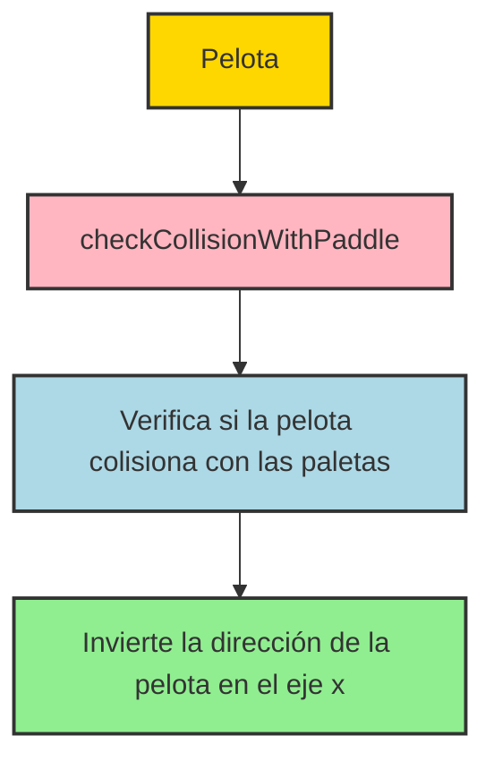
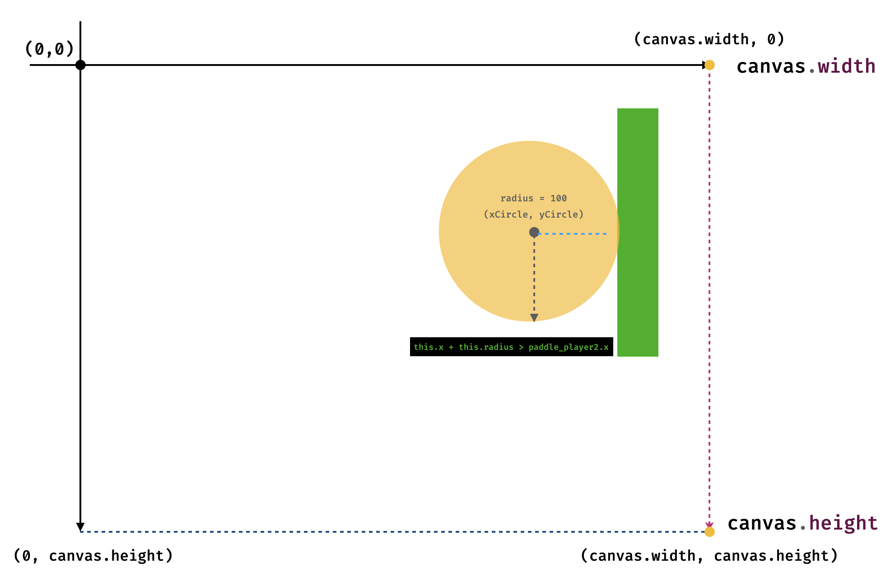

# Creando un videojuego: Pong

Para este primer proyecto vamos a usar JavaScript para crear un juego arcade clásico: Pong. Pong fue uno de los primeros videojuegos de la historia y fue lanzado en 1972. El juego es muy simple: dos jugadores controlan una paleta cada uno y deben golpear una pelota de un lado a otro de la pantalla. Si la pelota pasa la paleta del jugador, el otro jugador anota un punto.

## Setup del proyecto

Antes de empezar este proyecto vamos a definir nuestra estructura de archivos. Vamos a crear una carpeta llamada `pong` y dentro de ella vamos a crear los siguientes archivos:

```plaintext
pong/
├── index.html
├── styles.css
└── js/
    └── main.js
    └── pong.js
    └── ball.js
    └── paddle.js
    └── drawing.js
```

En el archivo `index.html` vamos a tener el siguiente código:

```html
<!DOCTYPE html>
<html lang="en">
  <head>
    <title>Pong</title>
    <meta charset="UTF-8" />
    <meta name="viewport" content="width=device-width" />
    <link rel="stylesheet" href="styles.css" />
  </head>
  <body>
    <canvas id="my-canvas" width="400" height="400"></canvas>
    <div class="controls-container">
      <button class="start-button">Start</button>
    </div>
    <script src="js/drawing.js"></script>
    <script src="js/ball.js"></script>
    <script src="js/paddle.js"></script>
    <script src="js/pong.js"></script>
    <script type="module" src="js/main.js"></script>
  </body>
</html>
```

En el archivo `styles.css` vamos a tener el siguiente código:

```css
* {
  box-sizing: "border-box";
  margin: 0;
  padding: 0;
}
```

### drawing.js

Una vez que vimos las estructura del HTML y CSS, vamos a empezar a trabajar en la lógica del juego. En el archivo `drawing.js` como ya hemos visto en capítulos anteriores, vamos a tener la lógica para capturar el elemento Canvas y obtener su contexto 2D con la variable `ctx`. Además, este archivo contiene dos funciones que nos harán más fácil visualizar las figuras en la pantalla.

```javascript
const canvas = document.getElementById("my-canvas");
canvas.style.backgroundColor = "#000000";
const ctx = canvas.getContext("2d");

function drawGridSystem() {
  ctx.strokeStyle = "#00FF00";
  ctx.lineWidth = 0.25;
  ctx.fillStyle = "#009900";

  for (let x = 0; x < canvas.width; x += 10) {
    ctx.beginPath();
    ctx.moveTo(x, 0);
    ctx.lineTo(x, canvas.height);
    ctx.lineWidth = x % 50 === 0 ? 0.5 : 0.25;
    ctx.stroke();
    if (x % 50 === 0) ctx.fillText(x, x, 10);
  }

  for (let y = 0; y < canvas.height; y += 10) {
    ctx.beginPath();
    ctx.moveTo(0, y);
    ctx.lineTo(canvas.width, y);
    ctx.lineWidth = y % 50 === 0 ? 0.5 : 0.25;
    ctx.stroke();
    if (y % 50 === 0) ctx.fillText(y, 0, y + 10);
  }
}

function drawCoordinate(ctx, x, y) {
  ctx.fillStyle = "#00FF00";
  ctx.fillText(`(${x},${y})`, x, y);
}
```

### main.js

Cuando hablamos de desarrollo y arquitectura de software, es importante tener en cuenta la separación de responsabilidades. En este caso, vamos a tener un archivo `main.js` que se encargará de inicializar el juego y ejecutar el loop principal, definiendo los FPS (frames per second) del juego.

```javascript
let on = true;

function drawFrame() {
  ctx.clearRect(0, 0, canvas.width, canvas.height);
  drawGridSystem(); // dibujar la cuadrícula
}

// bucle principal
setInterval(() => {
  if (on) drawFrame();
}, 1000 / 60);
```

Como podemos observar, en el archivo `main.js` estamos llamando a la función `drawFrame` que se encarga de limpiar el canvas y dibujar la grilla. A esta función le iremos agregando más lógica a medida que avancemos en el desarrollo del juego. Es decir, se encargará de ejecutar las funciones necesarias para dibujar los elementos del juego en el canvas o definir su comportamiento.

Si bién ya hemos visto el tema del setInterval en capítulos anteriores, en este caso estamos utilizando un valor de 1000/60, lo que nos da un valor de 60 FPS (frames per second). Esto significa que el juego se actualizará 60 veces por segundo, lo que es un valor estándar para juegos en 2D.

Tambiém hemos definido una variable `on` que nos permitirá pausar el juego. Por defecto, el juego se inicia en estado `on` y se ejecuta el loop principal. Más adelante, cuando agreguemos la lógica para iniciar y pausar el juego, vamos a cambiar el valor de esta variable.

### ball.js

En el archivo `ball.js` vamos a definir la lógica para crear la pelota del juego. La pelota es un círculo que se mueve por la pantalla y rebota en las paredes y en las paletas de los jugadores. Es decir la pelota es un objeto que tiene funciones y características propias, a las que llamamos métodos y propiedades de un objeto en programación. Si bien este curso no se enfoca en la programación orientada a objetos, vamos a ver aplicar algunos conceptos básicos de POO en este proyecto.

#### El objeto Ball


<p style="text-align: center; font-size:12px; font-family: sans-serif; position:relative; top:-24px; font-style:italic; font-weight: 100; opacity:80%">Pelota de Pong</p>

> "La programación es un reflejo de la percepción de la humanidad sobre el mundo que nos rodea, por lo tanto, mucho de lo que vemos en nuestro código puede tener una analogía en la vida real." - Cita del autor

En la vida real, una pelota tiene propiedades como su posición, velocidad, dirección y tamaño. En programación, podemos representar estas propiedades con variables y funciones. En este caso, vamos a definir un objeto `Ball` que tenga las siguientes propiedades:

- `x`: posición en el eje x
- `y`: posición en el eje y
- `dx`: velocidad en el eje x
- `dy`: velocidad en el eje y
- `radius`: radio de la pelota
- `color`: color de la pelota
- `draw`: función para dibujar la pelota
- `updatePosition`: función para actualizar la posición de la pelota

`js/ball.js`

```javascript
const ball = {
  x: canvas.width / 2,
  y: canvas.height / 2,
  dx: 2,
  dy: 2,
  radius: 6,
  color: "#FFFFFF",
  draw: function () {
    ctx.beginPath();
    ctx.arc(this.x, this.y, this.radius, 0, Math.PI * 2);
    ctx.fillStyle = ball.color;
    ctx.fill();
    ctx.closePath();
  },
  updatePosition: function () {
    this.x += this.dx;
    this.y += this.dy;
  },
};
```

<video style="display:block; margin-left:auto; margin-right:auto; width:60%;" src="image/b.CreandoUnVideoJuego/1731857407773.mp4" controls></video>

<p style="text-align: center; font-size:12px; font-family: sans-serif; position:relative; top:-24px; font-style:italic; font-weight: 100; opacity:80%">Pelota de Pong animada</p>

En el código anterior, hemos definido un objeto `ball` con las propiedades `x`, `y`, `dx`, `dy`, `radius`, `color`, `draw` y `updatePosition`. La función `draw` se encarga de dibujar la pelota en el canvas y la función `updatePosition` se encarga de actualizar la posición de la pelota en cada frame del juego.

##### `dx` y `dy`

Las propiedades `dx` y `dy` representan la velocidad de la pelota en los ejes x e y respectivamente. En este caso, hemos definido un valor de 2 para ambas propiedades, lo que significa que la pelota se moverá 2 píxeles en cada frame del juego. Si queremos que la pelota se mueva más rápido, podemos aumentar el valor de estas propiedades.

Por otro lado, si queremos que la pelota se mueva en una dirección específica, podemos cambiar el signo de estas propiedades. Por ejemplo, si queremos que la pelota se mueva hacia arriba, podemos cambiar el signo de `dy` a -2. De esta forma, la pelota se moverá hacia arriba en cada frame del juego.

##### `this`

La palabra clave `this` se refiere al objeto actual en el que se está ejecutando el código. En este caso, `this` se refiere al objeto `ball` y nos permite acceder a sus propiedades y métodos dentro de las funciones `draw` y `updatePosition`. De esta forma, podemos modificar las propiedades del objeto `ball` desde dentro de sus propias funciones.


#### Agregando los métodos `draw` y `updatePosition` al loop principal

Una vez que hemos definido el objeto `ball`, vamos a agregar sus métodos `draw` y `updatePosition` al loop principal del juego. De esta forma, la pelota se dibujará en el canvas y se actualizará su posición en cada frame del juego.

`js/main.js`

```javascript
let on = true;
ball.draw();

function drawFrame() {
  ctx.clearRect(0, 0, canvas.width, canvas.height);
  drawGridSystem(); // dibujar la cuadrícula
  ball.draw(); // dibujar la bola
  ball.updatePosition(); // actualizar la posición de la bola
}

// bucle principal
setInterval(() => {
  if (on) drawFrame();
}, 1000 / 60);
```

En el código anterior, hemos agregado las funciones `ball.draw()` y `ball.updatePosition()` al loop principal del juego. De esta forma, la pelota se dibujará en el canvas y se actualizará su posición en cada frame del juego. Si ejecutamos el juego en este punto, veremos que la pelota se mueve en línea recta por la pantalla.

#### Implementando la lógica de rebote

En esta primera instancia la pelota se mueve en línea recta por la pantalla, pero no rebota en las paredes ni en las paletas de los jugadores. Como aún no hemos implementado las paletas, vamos a escribir la lógica para que la pelota rebote en las paredes del canvas. Posteriormente, cuando implementemos las paletas, vamos a agregar la lógica para que la pelota rebote en las paletas de los jugadores y anote puntos si golpea las paredes laterales.

Para implementar esta lógica trabajemos muy de la mano con la implementación de dos nuevo métodos en el objeto `ball`:

- `checkCollision`: función para verificar si la pelota colisiona con las paredes del canvas
- `reverseDirection`: función para invertir la dirección de la pelota cuando colisiona con las paredes

`js/ball.js`

```javascript
const ball = {
  x: 100,
  y: 50,
  dx: 2,
  dy: 2,
  radius: 6,
  color: "#FFFFFF",
  draw: function () {
    ctx.beginPath();
    ctx.arc(this.x, this.y, this.radius, 0, Math.PI * 2);
    ctx.fillStyle = ball.color;
    ctx.fill();
    ctx.closePath();
  },
  updatePosition: function () {
    this.x += this.dx;
    this.y += this.dy;
    this.checkCollision();
  },
  checkCollision: function () {
    if (this.x + this.radius > canvas.width || this.x - this.radius < 0) {
      this.reverseDirection("x");
    }
    if (this.y + this.radius > canvas.height || this.y - this.radius < 0) {
      this.reverseDirection("y");
    }
  },
  reverseDirection: function (axis) {
    if (axis === "x") {
      this.dx = -this.dx;
    } else if (axis === "y") {
      this.dy = -this.dy;
    }
  },
};
```

Cómo podemos ver, estamos aplicando el mismo razonamiento que en el capítulo anterior para la detección de colisiones. Si sabemos puntualmente las medidas del canvas, podemos saber cuándo la pelota colisiona con las paredes. En este caso, si la pelota colisiona con las paredes laterales, invertimos la dirección en el eje x y si colisiona con las paredes superior e inferior, invertimos la dirección en el eje y.

En pocas palabras, cada vez que mi pelota cambia de posición se debe verificar si colisiona con las paredes del canvas usando la función `checkCollision`. Si la pelota colisiona con las paredes, se debe invertir la dirección de la pelota en el eje correspondiente usando la función `reverseDirection`.

## Creando las paletas de los jugadores

Ahora que ya hemos implementado la lógica para la pelota, vamos a crear las paletas de los jugadores. Las paletas son rectángulos que se mueven verticalmente por la pantalla y golpean la pelota para evitar que pase al otro lado. Cada jugador controla una paleta y debe moverla hacia arriba y hacia abajo para golpear la pelota.

En este enfoque, vamos a crear un objeto `Paddle` que tenga las siguientes propiedades:

- `x`: posición en el eje x
- `y`: posición en el eje y
- `width`: ancho de la paleta
- `height`: alto de la paleta
- `color`: color de la paleta
- `speed`: velocidad de la paleta
- `draw`: función para dibujar la paleta
- `updatePosition`: función para actualizar la posición de la paleta
- `moveUp`: función para mover la paleta hacia arriba
- `moveDown`: función para mover la paleta hacia abajo
- `checkCollision`: función para verificar si la paleta colisiona con las paredes del canvas

Para implementar ambas paletas, tenemos que tener en cuenta que la paleta que se ubicará en la parte izquierda será controlada por la "máquina" y la paleta que se ubicará en la parte derecha será controlada por el jugador. Por lo tanto, vamos a crear dos objetos `Paddle` que se moverán en direcciones opuestas.
Para diferencia las paletas, vamos a agregar una propiedad `side` que nos permitirá identificar si la paleta es del jugador o de la máquina.

`js/paddle.js`

```javascript
const paddle_player1 = {
  x: 10,
  y: canvas.height / 2 - 30,
  width: 10,
  height: 60,
  color: "#fb2e01",
  speed: 5,
  side: "left",
  draw: function () {
    ctx.fillStyle = this.color;
    ctx.fillRect(this.x, this.y, this.width, this.height);
  },
  updatePosition: function () {
    this.checkCollision();
  },
  moveUp: function () {
    this.y -= this.speed;
  },
  moveDown: function () {
    this.y += this.speed;
  },
  checkCollision: function () {
    if (this.y < 0) {
      this.y = 0;
    } else if (this.y + this.height > canvas.height) {
      this.y = canvas.height - this.height;
    }
  },
};

const paddle_player2 = {
  x: canvas.width - 20,
  y: canvas.height / 2 - 30,
  width: 10,
  height: 60,
  color: "#6fcb9f",
  speed: 5,
  side: "right",
  draw: function () {
    ctx.fillStyle = this.color;
    ctx.fillRect(this.x, this.y, this.width, this.height);
  },
  updatePosition: function () {
    this.checkCollision();
  },
  moveUp: function () {
    this.y -= this.speed;
  },
  moveDown: function () {
    this.y += this.speed;
  },
  checkCollision: function () {
    if (this.y < 0) {
      this.y = 0;
    } else if (this.y + this.height > canvas.height) {
      this.y = canvas.height - this.height;
    }
  },
};
```

> **Nota:** En este caso, hemos definido dos paletas: `paddle_player1` y `paddle_player2`. Sin embargo, en una planteo más avanzado podríamos aplicar un enfoque más orientado a objetos y crear una clase `Paddle` que nos permita instanciar múltiples paletas con diferentes propiedades y métodos. En este caso, hemos optado por un enfoque más simple para facilitar la comprensión del código ya que el objetivo principal de este proyecto es aprender los conceptos básicos de la programación de videojuegos.

### Dibujando las paletas en el canvas

Una vez que hemos definido los objetos `paddle_player1` y `paddle_player2`, vamos a agregar sus métodos `draw` al loop principal del juego para dibujar las paletas en el canvas.

`js/main.js`

```javascript
let on = true;
ball.draw();

function drawFrame() {
  ctx.clearRect(0, 0, canvas.width, canvas.height);
  drawGridSystem(); // dibujar la cuadrícula
  ball.draw(); // dibujar la bola
  ball.updatePosition(); // actualizar la posición de la bola
  paddle_player1.draw(); // dibujar la paleta del jugador 1
  paddle_player2.draw(); // dibujar la paleta del jugador 2
}

// bucle principal
setInterval(() => {
  if (on) drawFrame();
}, 1000 / 60);
```

En el código anterior, hemos agregado las funciones `paddle_player1.draw()` y `paddle_player2.draw()` al loop principal del juego. De esta forma, las paletas se dibujarán en el canvas en cada frame del juego.

### Moviendo las paletas con el mouse

Existen muchas formas de darle control a las paletas, podríamos usar las teclas del teclado, el mouse o incluso el touch de un dispositivo móvil. En este caso, vamos a implementar el movimiento de las paletas usando el mouse. Para ello, vamos a agregar un evento `mousemove` al canvas que nos permitirá detectar la posición del mouse y mover la paleta del jugador en consecuencia.

`js/main.js`

```javascript
let on = true;
ball.draw();

function drawFrame() {
  ctx.clearRect(0, 0, canvas.width, canvas.height);
  drawGridSystem(); // dibujar la cuadrícula
  ball.draw(); // dibujar la bola
  ball.updatePosition(); // actualizar la posición de la bola
  paddle_player1.draw(); // dibujar la paleta del jugador 1
  paddle_player2.draw(); // dibujar la paleta del jugador 2
}

// eventos
canvas.addEventListener("mousemove", (event) => {
  const rect = canvas.getBoundingClientRect();
  const mouseY = event.clientY - rect.top;
  paddle_player2.y = mouseY - paddle_player1.height / 2;
});

// bucle principal
setInterval(() => {
  if (on) drawFrame();
}, 1000 / 60);
```

Para tener un orden en el código, he colocado un pequeño comentario luego de definir las funciones. En mi experiencia, toda hoja de script puede dividirse de esta forma:

```plaintext
// Definición de variables

// Definición de funciones

// Eventos

// Ejeciones inmediatas
```

Como pueden ver, la sección de eventos es la que se encarga de escuchar las acciones del usuario y ejecutar las funciones correspondientes. En este caso, estamos escuchando el evento `mousemove` del canvas y actualizando la posición de la paleta del jugador 2 en función de la posición del mouse.

#### Cómo funciona el evento `mousemove`

El evento `mousemove` se dispara cuando el usuario mueve el mouse sobre un elemento. En este caso, estamos escuchando el evento `mousemove` del canvas y obteniendo la posición del mouse en relación al canvas. Para ello, estamos utilizando la propiedad `clientY` del evento y la función `getBoundingClientRect()` del canvas para obtener la posición del mouse en relación al canvas.

##### `getBoundingClientRect()`

La función `getBoundingClientRect()` devuelve el tamaño de un elemento y su posición relativa al viewport. En este caso, estamos utilizando esta función para obtener la posición del canvas en relación al viewport y calcular la posición del mouse en relación al canvas.



Es importante que el cálculo de la posición del mouse en relación al canvas sea tomando en cuenta la posición del canvas en relación al viewport (la pantalla). De esta forma, podemos obtener la posición del mouse en relación al canvas y mover la paleta del jugador en consecuencia.

### Detectando colisiones entre la pelota y las paletas

Hasta ahora, hemos implementado la lógica para la pelota y las paletas por separado. Sin embargo, el objetivo del juego es que la pelota rebote en las paletas y anote puntos si golpea las paredes laterales. Para ello, vamos a implementar la lógica para detectar colisiones entre la pelota y las paletas y hacer que la pelota rebote en las paletas si colisiona con ellas.

Actualmente nuestro objeto `ball` se ve de la siguiente forma:

`ball.js`

```javascript
const ball = {
  x: 100,
  y: 50,
  dx: 2,
  dy: 2,
  radius: 6,
  color: "#FFFFFF",
  draw: function () {
    ctx.beginPath();
    ctx.arc(this.x, this.y, this.radius, 0, Math.PI * 2);
    ctx.fillStyle = ball.color;
    ctx.fill();
    ctx.closePath();
  },
  updatePosition: function () {
    this.x += this.dx;
    this.y += this.dy;
    this.checkCollision();
  },
  checkCollision: function () {
    if (this.x + this.radius > canvas.width || this.x - this.radius < 0) {
      this.reverseDirection("x");
    }
    if (this.y + this.radius > canvas.height || this.y - this.radius < 0) {
      this.reverseDirection("y");
    }
  },
  reverseDirection: function (axis) {
    if (axis === "x") {
      this.dx = -this.dx;
    } else if (axis === "y") {
      this.dy = -this.dy;
    }
  },
};
```

Como podemos ver ya tenemos la lógica para detectar colisiones con las paredes del canvas y hacer que la pelota rebote en las paredes. Ahora vamos a agregar la lógica para detectar colisiones con las paletas y hacer que la pelota rebote en las paletas si colisiona con ellas.

Para ello, vamos a agregar un nuevo método `checkCollisionWithPaddle` al objeto `ball` que se encargará de detectar colisiones con las paletas y hacer que la pelota rebote en las paletas si colisiona con ellas.

`ball.js`

```javascript
const ball = {
  x: 100,
  y: 50,
  dx: 2,
  dy: 2,
  radius: 6,
  color: "#FFFFFF",
  draw: function () {
    ctx.beginPath();
    ctx.arc(this.x, this.y, this.radius, 0, Math.PI * 2);
    ctx.fillStyle = ball.color;
    ctx.fill();
    ctx.closePath();
  },
  updatePosition: function () {
    this.x += this.dx;
    this.y += this.dy;
    this.checkCollision();
    this.checkCollisionWithPaddle();
  },
  checkCollision: function () {
    if (this.x + this.radius > canvas.width || this.x - this.radius < 0) {
      this.reverseDirection("x");
    }
    if (this.y + this.radius > canvas.height || this.y - this.radius < 0) {
      this.reverseDirection("y");
    }
  },
  checkCollisionWithPaddle: function () {
    if (
      this.x + this.radius > paddle_player2.x &&
      this.y > paddle_player2.y &&
      this.y < paddle_player2.y + paddle_player2.height
    ) {
      this.reverseDirection("x");
    }
    if (
      this.x - this.radius < paddle_player1.x + paddle_player1.width &&
      this.y > paddle_player1.y &&
      this.y < paddle_player1.y + paddle_player1.height
    ) {
      this.reverseDirection("x");
    }
  },
  reverseDirection: function (axis) {
    if (axis === "x") {
      this.dx = -this.dx;
    } else if (axis === "y") {
      this.dy = -this.dy;
    }
  },
};
```

En el código anterior, hemos agregado un nuevo método `checkCollisionWithPaddle` al objeto `ball` que se encarga de detectar colisiones con las paletas y hacer que la pelota rebote en las paletas si colisiona con ellas. Para ello, estamos verificando si la posición de la pelota coincide con la posición de las paletas y si la pelota colisiona con las paletas, invertimos la dirección de la pelota en el eje x.

Vamos a ver esta lógica paso por paso.

#### `checkCollisionWithPaddle`

En la función `checkCollisionWithPaddle` estamos verificando si la posición de la pelota coincide con la posición de las paletas. Para ello, estamos comparando la posición de la pelota con la posición de las paletas y si la pelota colisiona con las paletas, invertimos la dirección de la pelota en el eje x.



En este caso, estamos verificando el punto más a la derecha de la pelota (`this.x + this.radius`) y si este punto es mayor que la posición de la paleta del jugador 2 (`paddle_player2.x`) y si la posición de la pelota en el eje y (`this.y`) está dentro de la paleta del jugador 2 (`paddle_player2.y` y `paddle_player2.y + paddle_player2.height`), invertimos la dirección de la pelota en el eje x.

De la misma forma, estamos verificando el punto más a la izquierda de la pelota (`this.x - this.radius`) y si este punto es menor que la posición de la paleta del jugador 1 (`paddle_player1.x + paddle_player1.width`) y si la posición de la pelota en el eje y (`this.y`) está dentro de la paleta del jugador 1 (`paddle_player1.y` y `paddle_player1.y + paddle_player1.height`), invertimos la dirección de la pelota en el eje x.



